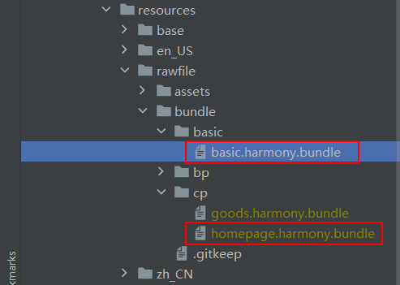
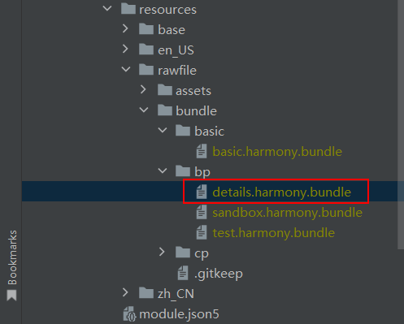

# RN-Native 接入

​ 下面我们将使用配套的`MyApplicationReplace`替换文件和`SampleApp`工程举例说明您在使用`RNApp`、`RNSurface`、`RNInstance`时可能会遇到的三种常见场景，本节介绍了三种场景的使用具体步骤。

## 使用 React Native 所需的配置

1. `rnInstanceConfig`:用于创建`RNInstance`的`RNInstance`或`RNInstanceOptions`。如果提供了[RNInstanceOptions](API接口说明#RNApp)，则此组件负责创建和管理`RNInstance`。
2. 如果想要保证React Native鸿蒙化的部分效果与iOS或Android保持一致，需要在工程入口目录的`module.json5`中配置相应的开关：
    - `half_leading`：设置`lineHeight`属性后，底层字体引擎默认排版不按照行高居中，需要打开这个开关开启文字居中；
    - `can_preview_text`：目前`TextInput`输入的时候无法显示汉语拼音，需要打开这个开关才可以显示拼音。
      ```json5
      // module.json5
      "metadata": [
        {
          "name": "half_leading",
          "value": "true"
        },
        {
          "name": "can_preview_text",
          "value": "true",
        }
      ]
      ```
3. 如果想要使用沙箱路径下的bundle或图片，可以参考[如何加载沙箱路径bundle和图片](常见开发场景.md#如何加载沙箱路径bundle和图片)。


## 单实例、单Surface、单Bundle

​ 该场景为RN Native工程中最简单的场景，可直接使用`RNApp`进行页面构建。根据您的业务场景，也可将`RNApp`拆分成`RNSurface`和`RNInstance`去灵活使用。详细创建`RNSurface`和`RNInstance`的过程请参考源码`@rnoh/react-native-openharmony/src/main/ets/RNApp.ets`。

直接使用`RNApp`构建步骤如下：

1. 修改EntryAbility类，让其继承了 RNAbility 类，用于指定入口页面路径。

   ```TypeScript
   // MyApplicationReplace/entry/src/main/ets/entryability/EntryAbility.ts
   
   import { RNAbility } from '@rnoh/react-native-openharmony';

   export default class EntryAbility extends RNAbility {
     getPagePath() {
       return 'pages/Index';
     }
   }

   ```

2. 在入口文件`Index.ets`中，使用RNApp。

   ```TypeScript
   // MyApplicationReplace/entry/src/main/ets/pages/Index.ets
   
   import {
      AnyJSBundleProvider,
      ComponentBuilderContext,
      FileJSBundleProvider,
      MetroJSBundleProvider,
      ResourceJSBundleProvider,
      RNApp,
      RNOHErrorDialog,
      RNOHLogger,
      TraceJSBundleProviderDecorator,
      RNOHCoreContext
    } from '@rnoh/react-native-openharmony';
    import font from '@ohos.font';
    import { createRNPackages } from '../RNPackagesFactory';

    const arkTsComponentNames: Array<string> = [SampleView.NAME, GeneratedSampleView.NAME, PropsDisplayer.NAME];
    @Builder
    export function buildCustomRNComponent(ctx: ComponentBuilderContext) {
      // There seems to be a problem with the placement of ArkTS components in mixed mode. Nested Stack temporarily avoided.
      Stack(){
      }
      .position({x:0, y: 0})

    }

    const wrappedCustomRNComponentBuilder = wrapBuilder(buildCustomRNComponent)

    @Entry
    @Component
    struct Index {
      @StorageLink('RNOHCoreContext') private rnohCoreContext: RNOHCoreContext | undefined = undefined
      @State shouldShow: boolean = false
      private logger!: RNOHLogger


      aboutToAppear() {
        this.logger = this.rnohCoreContext!.logger.clone("Index")
        const stopTracing = this.logger.clone("aboutToAppear").startTracing()
        for (const customFont of fonts) {
          font.registerFont(customFont)
        }

        this.shouldShow = true
        stopTracing()
      }

      onBackPress(): boolean | undefined {
        // NOTE: this is required since `Ability`'s `onBackPressed` function always
        // terminates or puts the app in the background, but we want Ark to ignore it completely
        // when handled by RN
        this.rnohCoreContext!.dispatchBackPress()
        return true
      }

      build() {
        Column() {
          if (this.rnohCoreContext && this.shouldShow) {
            if (this.rnohCoreContext?.isDebugModeEnabled) {
              RNOHErrorDialog({ ctx: this.rnohCoreContext })
            }
            RNApp({
              rnInstanceConfig: {
                createRNPackages,
                enableNDKTextMeasuring: true,
                enableBackgroundExecutor: false,
                enableCAPIArchitecture: true,
                arkTsComponentNames: []
              },
              initialProps: { "foo": "bar" } as Record<string, string>,
              appKey: "app_name",
              wrappedCustomRNComponentBuilder: wrappedCustomRNComponentBuilder,
              onSetUp: (rnInstance) => {
                rnInstance.enableFeatureFlag("ENABLE_RN_INSTANCE_CLEAN_UP")
              },
              jsBundleProvider: new TraceJSBundleProviderDecorator(
                new AnyJSBundleProvider([
                  new MetroJSBundleProvider(),
                  // NOTE: to load the bundle from file, place it in
                  // `/data/app/el2/100/base/com.rnoh.tester/files/bundle.harmony.js`
                  // on your device. The path mismatch is due to app sandboxing on HarmonyOS
                  new FileJSBundleProvider('/data/storage/el2/base/files/bundle.harmony.js'),
                  new ResourceJSBundleProvider(this.rnohCoreContext.uiAbilityContext.resourceManager, 'hermes_bundle.hbc'),
                  new ResourceJSBundleProvider(this.rnohCoreContext.uiAbilityContext.resourceManager, 'bundle.harmony.js')
                ]),
                this.rnohCoreContext.logger),
            })
          }
        }
        .height('100%')
        .width('100%')
      }
    }

   ```

## 单实例、单Surface、多Bundle

1. 若要实现该场景，首先需要进行拆包打包流程，将单Bundle拆成多Bundle进行打包，详细流程请见[RN JS打包 > 多Bundle打包](RN-JS打包.md#多bundle打包)。完成这一步生成多个Bundle文件后，需要按顺序分别加载这些Bundle文件，下面用`SampleApp`工程的`homepage`模块举例说明。

   对`homepage`模块拆包打包后会生成两个Bundle文件：`SampleApp/entry/src/main/resources/rawfile/bundle/basic/basic.harmony.bundle`和`SampleApp/entry/src/main/resources/rawfile/bundle/cp/homepage.harmony.bundle`。

   

   在RN JS打包指导文档中可以得知，`basic`为基础包，`homepage`为业务包。

2. 加载第一个Bundle文件：在初始化过程中，创建了对应的`RNInstance`实例后，需要优先加载`basic`的Bundle文件，使用`RNInstance`实例暴露的接口`runJSBundle`加载Bundle文件。

   ```TypeScript
   // SampleApp/entry/src/main/ets/pages/Index.ets
   
   ...
   @Entry()
   @Component
   struct Index {
     ...
     aboutToAppear() {
       if (!this.rnohCoreContext) return;
       this.loadMetroBundle()
     }
     ...
     loadMetroBundle() {
       LoadManager.loadMetroBundle(this.getUIContext()).then((flag: boolean) => {
         ...
         this.register().then((instanceMap: Map<string, RNInstance>) => {
           this.isBundleReady = true;
           console.log("registered instance", JSON.stringify(instanceMap))
         });
       })
     }
   
     async register(): Promise<Map<string, RNInstance>> {
       ...
       let instanceMap: Map<string, RNInstance> = new Map();
       // 创建cpInstance
       const cpInstance: RNInstance = await this.rnohCoreContext.createAndRegisterRNInstance({
         createRNPackages: createRNPackages,
         enableNDKTextMeasuring: true,
         enableBackgroundExecutor: false,
         enableCAPIArchitecture: ENABLE_CAPI_ARCHITECTURE,
         arkTsComponentNames: arkTsComponentNames
       });
       const ctxCp: RNComponentContext = new RNComponentContext(
         RNOHContext.fromCoreContext(this.rnohCoreContext!, cpInstance),
         wrapBuilder(buildCustomComponent),
         wrapBuilder(buildRNComponentForTag),
         new Map()
       );
       ...
       // 在LoadManager中注册cpInstance
       LoadManager.cpInstance = cpInstance;
       // 在创建对应的RNInstance后优先加载basic的Bundle文件
       await cpInstance.runJSBundle(new ResourceJSBundleProvider(getContext().resourceManager, 'bundle/basic/basic.harmony.bundle'));
       instanceMap.set('CPReactInstance', cpInstance);
       instanceMap.set('BPReactInstance', bpInstance);
       return instanceMap;
     }
     ...
   }
   ```

3. 加载第二个Bundle文件：在`homepage`模块的业务代码中去加载`homepage`的Bundle文件。

   ```TypeScript
   // SampleApp/entry/src/main/ets/pages/HomePage.ets
   
   ...
   @Component
   export default struct HomePage {
     // 获取cpInstance实例
     private instance: RNInstance = LoadManager.cpInstance
     private bundlePath = 'bundle/cp/homepage.harmony.bundle'
     private moduleName = 'HomePage'
     ...
     build() {
       ...
       BaseRN({
         rnInstance: this.instance,
         moduleName: this.moduleName,
         bundlePath: this.bundlePath,
       }).align(Alignment.Top).margin({ top: 0 })
    ...
     }
   }
   ```

   使用`BaseRN`类加载本地的业务包Bundle，传入的三个参数分别为

   ​ `rnInstance`：之前创建的`RNInstance`，即`cpInstance`；

   ​ `moduleName`：模块名`HomePage`；

   ​ `bundlePath`：`homepage`模块的Bundle文件路径。

   `BaseRN`的业务代码如下，使用`LoadManager.loadBundle`方法加载业务包bundle，将业务模块对应的`RNInstance`实例、本地Bundle路径作为参数传进去，使用`RNInstance`实例暴露的接口`runJSBundle`加载Bundle文件。

   加载成功Bundle文件后，将`RNInstance`实例与`RNSurface`绑定，渲染`RNSurface`。

   ```TypeScript
   // SampleApp/entry/src/main/ets/rn/BaseRN.ets
   
   ...
   @Component
   export struct BaseRN {
     ...
     aboutToAppear() {
       LoadManager.loadBundle(this.rnInstance, this.bundlePath, this.useBundleCache).then(() => {
         this.isBundleReady = true;
         console.log('加载完成'+this.bundlePath)
       }).catch((err: Error) => {
         console.log('加载失败'+this.bundlePath+err)
       });
     }
   
     build() {
       Column() {
         if (this.rnohCoreContext && this.isBundleReady) {
           RNSurface({
             surfaceConfig: {
               appKey: this.moduleName,
               initialProps: this.initProps,
             },
             ctx: new RNComponentContext(
               RNOHContext.fromCoreContext(this.rnohCoreContext!, this.rnInstance),
               wrappedCustomRNComponentBuilder,
               wrapBuilder(buildRNComponentForTag),
               new Map()
             ),
           })
         }
       }
       .height('100%')
       .width('100%')
     }
   }
   ```

## 多实例、多Surface、多Bundle

​ 在[环境搭建 > 工程内容介绍](环境搭建.md#工程内容介绍)中，介绍了空工程`SampleProject`和`SampleApp`的内容主要包括首页HomePage、商品Goods、测试用例test、商品详情Detail四个模块，通过加载四个业务模块的bundle包创建对应的`RNSurface`，最后将`RNSurface`嵌入ArtkUI的页面组件中完成HarmonyOS侧的页面构建。因此空工程`SampleProject`和`SampleApp`就是一个多实例、多Surface、多Bundle场景，下面通过业务代码举例说明该场景。

​ 多实例、多Surface、多Bundle场景就是多个单实例、单Surface、多Bundle场景组合在一起，在该场景中，需要特别注意的点是，不要混淆实例与RNSurface的对应关系，实例加载多个Bundle文件的对应关系。在单实例、单Surface、多Bundle的场景中已经详细说明了`homepage`模块的实现，下面通过添加上`Detail`模块来说明多实例、多Surface、多Bundle场景。

1. 对`Detail`模块打包只会生成一个Bundle文件：`SampleApp/entry/src/main/resources/rawfile/bundle/bp/details.harmony.bundle`。

   
2. 在创建`homepage`模块需要用到的`cpInstance`的同时也去创建`Detail`模块需要用到的`bpInstance`。

   ```TypeScript
   // SampleApp/entry/src/main/ets/pages/Index.ets
   
   ...
   @Entry()
   @Component
   struct Index {
     ...
     async register(): Promise<Map<string, RNInstance>> {
       ...
       // 创建bpInstance
       const bpInstance: RNInstance = await this.rnohCoreContext.createAndRegisterRNInstance({
         createRNPackages: createRNPackages,
         enableNDKTextMeasuring: true,
         enableBackgroundExecutor: false,
         enableCAPIArchitecture: ENABLE_CAPI_ARCHITECTURE,
         arkTsComponentNames: arkTsComponentNames
       });
       const ctxBp: RNComponentContext = new RNComponentContext(
         RNOHContext.fromCoreContext(this.rnohCoreContext!, bpInstance),
         wrapBuilder(buildCustomComponent),
         wrapBuilder(buildRNComponentForTag),
         new Map()
       );
       // 在LoadManager中注册cpInstance、bpInstance
       LoadManager.cpInstance = cpInstance;
       LoadManager.bpInstance = bpInstance;
       await cpInstance.runJSBundle(new ResourceJSBundleProvider(getContext().resourceManager, 'bundle/basic/basic.harmony.bundle'));
       instanceMap.set('CPReactInstance', cpInstance);
       instanceMap.set('BPReactInstance', bpInstance);
       return instanceMap;
     }
     ...
   }
   ```

3. `Detail`模块是会渲染在`Goods`模块中，通过`Navigation`路由进行跳转。

   在`Details.ets`中，依然是使用`BaseRN`类加载`Detail`模块的业务包Bundle，传入的参数与`homepage`模块不同：

   ​ `rnInstance`：之前创建的`RNInstance`，即`bpInstance`；

   ​ `moduleName`：模块名`Details`；

   ​ `bundlePath`：`Details`模块的Bundle文件路径。

   ```TypeScript
   // SampleApp/entry/src/main/ets/pages/Details.ets
   
   import { RNInstance, RNOHCoreContext } from '@rnoh/react-native-openharmony';
   import { BaseRN, LoadManager } from '../rn';
   import { MetroBaseRN } from '../rn/MetroBaseRN'
   
   @Component
   export default struct Details {
     // 获取bpInstance
     private instance: RNInstance = LoadManager.bpInstance
     private bundlePath = 'bundle/bp/details.harmony.bundle'
     private moduleName = 'Details'
     ...
     build() {
       ...
       BaseRN({
         rnInstance: this.instance,
         moduleName: this.moduleName,
         bundlePath: this.bundlePath,
         initProps: this.initProps as Record<string, string>
       }).align(Alignment.Top).margin({ top: 20 })
       ...
     }
   }
   ```

这样就会得到：属于`homepage`模块的实例`cpInstance`，在其实例上加载的两个Bundle文件`basic.harmony.bundle`和`homepage.harmony.bundle`，与其实例绑定的RNSurface；属于`Details`模块的实例`bpInstance`，在其实例上加载的Bundle文件`details.harmony.bundle`，与其实例绑定的RNSurface。最终实现了多实例、多Surface、多Bundle的开发场景。

## 初始化参数传递

初始化参数通常用于初始化应用程序的一些配置信息，例如应用程序的主题、语言、网络配置等。这些参数可以在应用程序启动时从native层传递到JS层，以便JS层能够根据这些参数进行相应的初始化工作，以确保应用程序能够正常运行。

初始化参数传递方式有两种：

- 通过`RNSurface`传递
  
  通过空工程`SampleProject`和`SampleApp`示例代码来具体说明：
  
  1. 开发者需先自行定义需要传递的初始化数据。在`Details.ets`文件中我们给初始化参数`initProps`设置了改变布局、字体的`styles`和传递信息内容的`stringParam`。

     ```TypeScript
     // SampleApp/entry/src/main/ets/pages/Details.ets
     
     ...
     private container: Record<string, string | number> = {
       "backgroundColor": '#E6E6E6',
       "flex": 1,
       "padding": 20,
     }
     private apiFontSize: Record<string, string | number> = {
       'fontSize': 30,
       'color': 'white'
     }
     private styles: Record<string, object> = {
       'container': this.container,
       'apiFontSize': this.apiFontSize
     }
     private initProps: Record<string, string | object> = {};
     
     aboutToAppear() {
       this.initProps = {
         'stringParam': 'ArkTs传递给RN的参数：'+this.name,
         'styles' : this.styles
       };
     }
     ...
     ```

  2. 将设置好的`initProps`通过`MetroBaseRN`类或`BaseRN`类传递给`RNSurface`。

     ```TypeScript
     // SampleApp/entry/src/main/ets/pages/Details.ets
     
     ...
     build() {
       ...
       if (this.isMetroAvailable) {
         MetroBaseRN({
           moduleName: this.moduleName,
           initProps: this.initProps as Record<string, string>
         }).align(Alignment.Top).margin({ top: 20 })
       } else if (this.instance) {
         BaseRN({
           rnInstance: this.instance,
           moduleName: this.moduleName,
           bundlePath: this.bundlePath,
           initProps: this.initProps as Record<string, string>
         }).align(Alignment.Top).margin({ top: 20 })
       }
       ...
      }
      ...
     ```

  3. `MetroBaseRN` 类中使用了 `RNSurface` 组件，`surfaceConfig` 对象包含了 `RNSurface` 的配置信息，其中 `initialProps` 是初始化属性，`appKey` 是模块名称，`appKey` 要与JS侧`AppRegistry.registerComponent`传入的第一个参数相对应。

     ```TypeScript
     // SampleApp/entry/src/main/ets/rn/MetroBaseRN.ets
     
     ...
     build() {
       ...
       RNSurface({
         surfaceConfig: {
           appKey: this.moduleName,
           initialProps: this.initProps,
         },
         ctx: new RNComponentContext(
           RNOHContext.fromCoreContext(this.rnohCoreContext!, LoadManager.metroInstance),
           wrappedCustomRNComponentBuilder,
           wrapBuilder(buildRNComponentForTag),
           new Map()
         ),
       })
       ...
      }
      ...
     ```

  4. <span id="RNSurface-4">在JS侧需要通过`AppRegistry`来接收初始化参数。</span>

     使用`setWrapperComponentProvider`来包装根组件，其中回调函数中的参数`children`：渲染RN侧组件；`otherProps`：HarmonyOS侧传递过来的初始化数据内容。

     ```javascript
     // MainProject\src\bundles\Details\index.js
     
     import {AppRegistry, View, Text} from 'react-native';
     import AppDetails from './DetailsMainPage';
     import React from 'react';
     
     // 使用setWrapperComponentProvider来包装根组件。
     // children: 渲染RN侧组件；otherProps: HarmonyOS侧传递过来的数据内容。
     AppRegistry.setWrapperComponentProvider(appParams => {
         return function({children, ...otherProps}) {
             return (
                 <View style={otherProps.initialProps.styles.container}>
                     <View style={{'borderRadius': 10, 'backgroundColor': 'blue', height: 100, justifyContent: 'center'}}>
                         <Text style={otherProps.initialProps.styles.apiFontSize}>{otherProps.initialProps.stringParam}</Text>
                     </View>
                     <View>{children}</View>
                 </View>
             )
         }
     });
     
     AppRegistry.registerComponent('Details', () => AppDetails);
     ```

     打印`otherProps`可看到从Native侧传过来的初始化参数：

     ```json
     {"initialProps":{"concurrentRoot":true,"stringParam":"ArkTs传递给RN的参数：details1","styles":{"container":{"backgroundColor":"#E6E6E6","padding":20,"flex":1},"apiFontSize":{"fontSize":30,"color":"white"}}},"fabric":true,"showArchitectureIndicator":false}
     ```

- 通过`RNApp`传递
  
  将自定义的初始化参数设置在`RNApp`的`initialProps`属性上。
  
  ```typescript
  // SampleApp/entry/src/main/ets/pages/SandboxBundle.ets
  
  ...
  build() {
    ...
    if (this.rnAbility && this.hasBundle) {
      RNApp({
        rnInstanceConfig: { createRNPackages },
        initialProps: { "foo": "bar" } as Record<string, string>,
        appKey: "Sandbox",
        onSetUp: (rnInstance) => {
          rnInstance.enableFeatureFlag("ENABLE_RN_INSTANCE_CLEAN_UP")
        },
        jsBundleProvider: new FileJSBundleProvider(this.rnAbility.context.filesDir + '/' + this.bundlePath)
      })
    } else {
     ...
    }
  }
  ...
  ```
  
  JS侧接收初始化参数的方式与[通过`RNSurface`传递的第四步](#RNSurface-4)相同，需要注意JS侧`AppRegistry.registerComponent`传入的第一个参数要与传给`RNApp`的`appKey` 相同。
  
  打印`otherProps`可看到从Native侧传过来的初始化参数：
  
  ```json
  {"initialProps":{"concurrentRoot":true,"foo":"bar"},"fabric":true,"showArchitectureIndicator":false}
  ```

## Native加载Bundle方法

​ Native加载Bundle方法分为三种：本地文件路径加载Bundle、使用Metro服务加载Bundle和加载沙箱目录的Bundle。详细内容见[环境搭建 > 加载bundle包](环境搭建.md#加载bundle包)。
