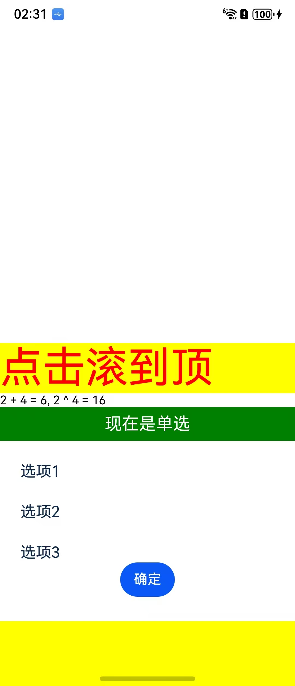

# 说明

这是RNOH Autolinking的demo工程

## 目录结构

```md
AutolinkingSample
├── NativeProject harmony工程
├── react-native-oh RNOH前端及手脚架
├── ReactProject 前端工程
├── screenshots 效果图
├── third-party-library-sample RN三方件示例
└── README.md
```

## 环境搭建

1. 将 `react-native-oh-react-native-harmony-0.77.xx.tgz` 和 `react-native-oh-react-native-harmony-cli-0.77.xx.tgz` 放置在 `react-native-oh` 目录下；
1. 在 `third-party-library-sample` 中运行 **npm pack** 进行打包；
1. 修改 `ReactProject/package.json` 中 `@react-native-oh/react-native-harmony` 和 `@react-native-oh/react-native-harmony-cli` 的版本号；
1. 修改 `NativeProject/hvigor/hvigor-config.json5` 中 `@rnoh/hvigor-plugin` 的版本号；
1. 在 `ReactProject` 目录下执行 **npm i** 安装依赖;
1. 用 DevEco Studio 打开 `NativeProject`，执行 **Sync and Refresh Project**；
1. 点击 File > Project Structure > Signing Configs，登录并完成签名；
1. 在 `ReactProject` 目录下执行 **npm start** 启动Metro;
1. 点击 DevEco Studio 右上角的 **run** 启动项目；

> NOTE: 安装时项目默认使用最新的RNOH依赖，如需安装特定版本请查阅[RNOH版本演进规划和分支策略](https://gitcode.com/openharmony-sig/ohos_react_native/wiki/RNOH版本演进规划和分支策略.md)获取版本号。
> 
> npm依赖安装： `npm i @react-native-oh/react-native-harmony@0.77.xx` `npm i --save-dev @react-native-oh/react-native-harmony-cli@0.77.xx`
> 
> ohpm依赖安装：`ohpm i @rnoh/react-native-openharmony@0.77.xx`

## 效果预览

启动后页面效果如下：



1. 点击【点击滚到顶】按钮，弹窗会滚到顶部；
1. 弹窗会滚到顶部后向下拉，会根据滚动位置决定最终停留在中间还是回到顶部；
1. 点击【选项1/2/3】，选项右侧会显示选中状态；
1. 点击【确定】按钮，会在VSCode控制台打印对应选项的value，如：`{"target": 14, "value": [1]}`；
1. 点击【现在是单选】按钮，按钮文案会改成【现在是多选】，继续点击【选项1/2/3】，可以让多个选项切换到选中状态；
1. 点击【确定】按钮，会在VSCode控制台打印对应选项的value，如：`{"target": 14, "value": [1,2]}`；