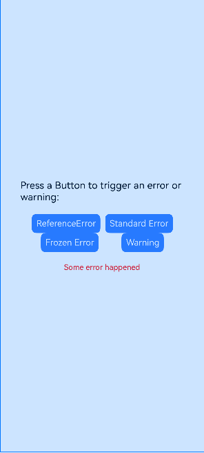
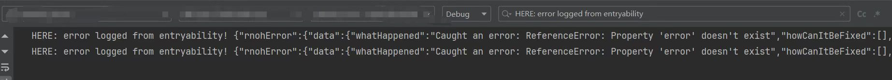
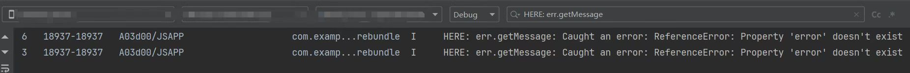
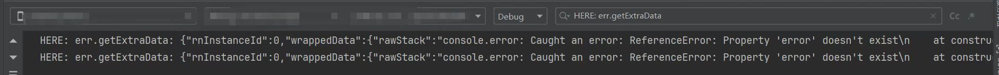
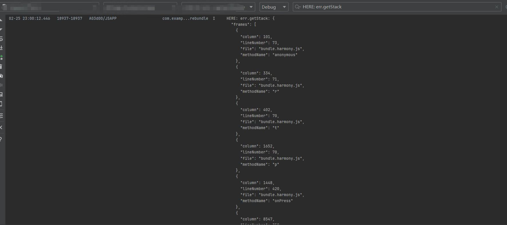
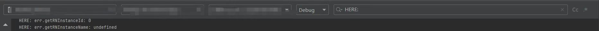

# 说明

这是一个支持捕捉bundle包的内部异常的示例工程。

# 目录结构

ReactProject -- RN 侧工程  
NativeProject -- 原生工程

# 环境搭建

1. 在 `ReactProject` 目录下执行 **npm i @react-native-oh/react-native-harmony@x.x.x**或**yarn add @react-native-oh/react-native-harmony@x.x.x** 安装依赖，执行 **npm run dev** 生成 bundle；
2. 在 `entry` 目录下执行 **ohpm i @rnoh/react-native-openharmony@x.x.x** 安装依赖；
3. 检查 `NativeProject`、`entry` 目录下是否生成 `oh-modules` 文件夹；
4. 用 DevEco Studio 打开 `NativeProject`，执行 **Sync and Refresh Project**；
5. 点击右上角的 **run** 启动项目。

# 效果预览
多个功能页面:
- ReferenceError
- Standard Error
- Frozen Error
- Warning

日志输出  
1.基础错误信息  
步骤：点击`ReferenceError`、`Standard Error`或者`Frozen Error`,在Hilog输入`HERE: error logged from entryability`过滤查询。  
效果：

2.错误消息  
步骤：点击`ReferenceError`、`Standard Error`或者`Frozen Error`,在Hilog输入`HERE: err.getMessage`过滤查询。  
效果：

3.解决建议  
步骤：点击`ReferenceError`、`Standard Error`或者`Frozen Error`,在Hilog输入`HERE: err.getSuggestions`过滤查询。  
效果：

4.额外数据  
步骤：点击`ReferenceError`、`Standard Error`或者`Frozen Error`,在Hilog输入`HERE: err.getExtraData`过滤查询。  
效果：

5.堆栈数据  
步骤：点击`ReferenceError`、`Standard Error`或者`Frozen Error`,在Hilog输入`HERE: err.getStack`过滤查询。  
效果：

6.RNInstanceError类型的错误实例  
步骤：点击`ReferenceError`、`Standard Error`或者`Frozen Error`,在Hilog输入`HERE: err.getRNInstance`过滤查询。  
效果：
