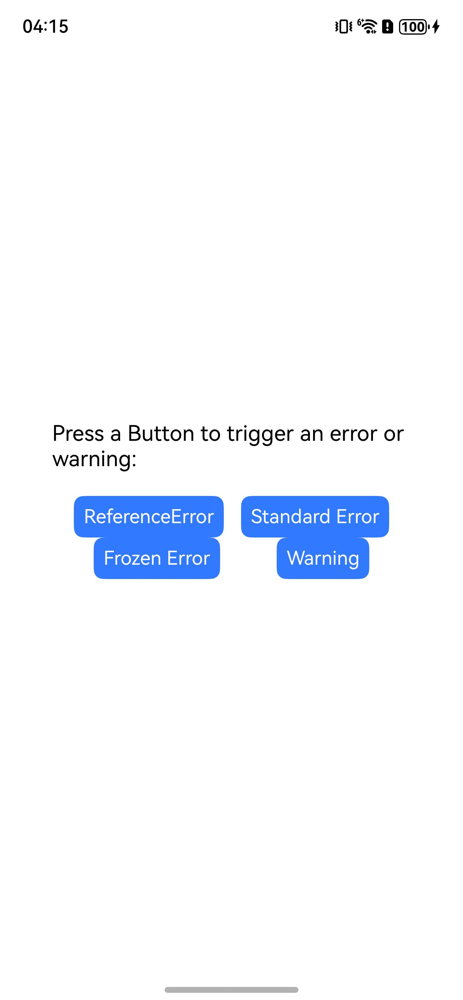
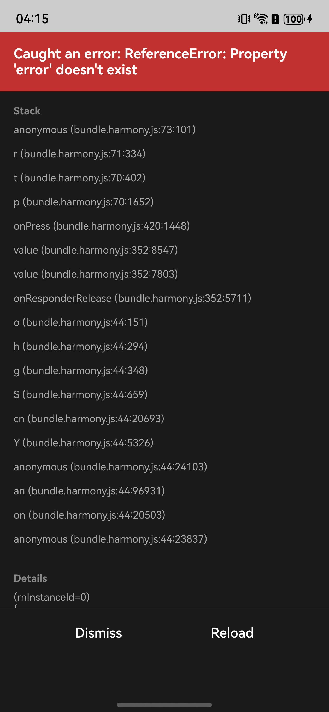
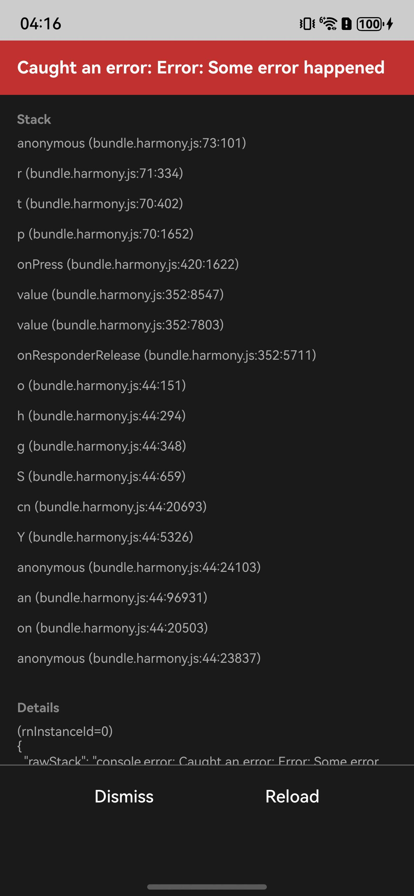
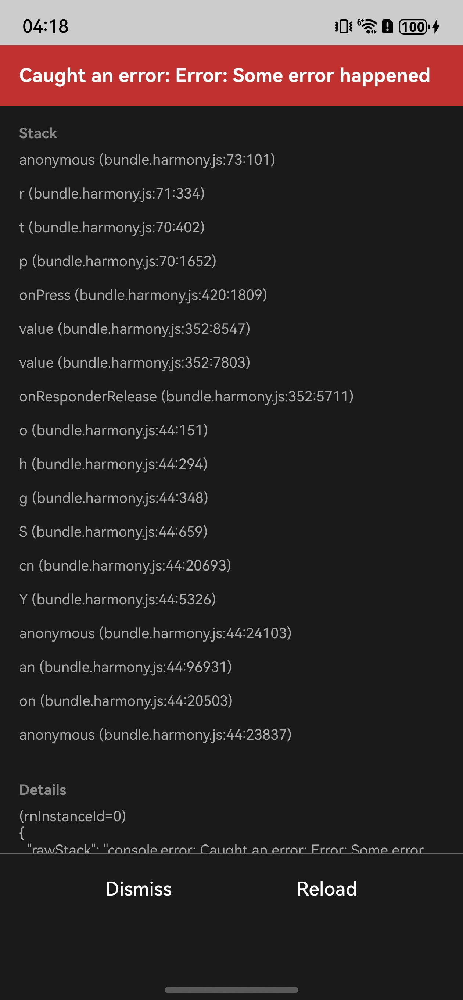
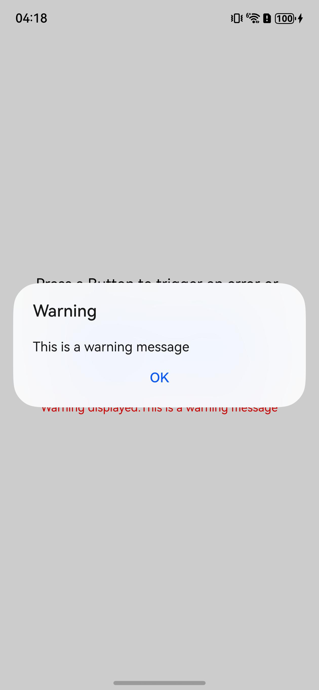

# 说明

这是一个支持捕捉bundle包的内部异常的示例工程。

# 目录结构

ReactProject -- RN 侧工程  
NativeProject -- 原生工程

# 环境搭建

1. 在 `ReactProject` 目录下执行 **npm i @react-native-oh/react-native-harmony@x.x.x**或**yarn add @react-native-oh/react-native-harmony@x.x.x** 安装依赖，执行 **npm run dev** 生成 bundle；
2. 在 `entry` 目录下执行 **ohpm i @rnoh/react-native-openharmony@x.x.x** 安装依赖；
3. 检查 `NativeProject`、`entry` 目录下是否生成 `oh-modules` 文件夹；
4. 用 DevEco Studio 打开 `NativeProject`，执行 **Sync and Refresh Project**；
5. 点击 File > Project Structure > Signing Configs，登录并完成签名；
6. 点击右上角的 **run** 启动项目。

# 效果预览
启动后页面效果如下：

<table style="width: 100%; margin: 0 auto; text-align: center;">
  <thead>
    <tr>
      <th style="width: 20%;">
        
      </th>
      <th style="width: 20%;">
        
      </th>
      <th style="width: 20%;">
        
      </th>
      <th style="width: 20%;">
        
      </th>
      <th style="width: 20%;">
        
      </th>
    </tr>
  </thead>
  <tbody>
    <tr>
      <td style="width: 20%;">
        首页
      </td>
      <td style="width: 20%;">
        点击【ReferenceError】按钮
      </td>
      <td style="width: 20%;">
        点击【Standard Error】按钮
      </td>
      <td style="width: 20%;">
        点击【Frozen Error】按钮
      </td>
      <td style="width: 20%;">
        点击【Warning】按钮
      </td>
    </tr>
  </tbody>
</table>
