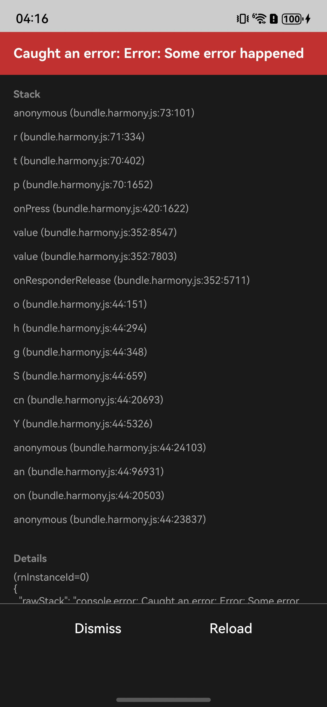

# 说明

这是一个支持捕捉bundle内部异常的示例工程

## 目录结构

```shell
├── NativeProject -- 原生工程
└── ReactProject -- RN 工程
```

## 环境搭建

1. 在 `ReactProject` 目录下执行 **npm i** 安装依赖，执行 **npm run dev** 生成 bundle；
2. 用 DevEco Studio 打开 `NativeProject`，执行 **Sync and Refresh Project**；
3. 点击 File > Project Structure > Signing Configs，登录并进行签名；
4. 点击右上角的 **run** 启动项目。

> NOTE: 安装时项目默认使用最新的RNOH依赖，如需安装特定版本请查阅[RNOH版本演进规划和分支策略](https://gitcode.com/openharmony-sig/ohos_react_native/wiki/RNOH版本演进规划和分支策略.md)获取版本号。
> 
> npm依赖安装： `npm i @react-native-oh/react-native-harmony@0.77.xx` `npm i --save-dev @react-native-oh/react-native-harmony-cli@0.77.xx`
> 
> ohpm依赖安装：`ohpm i @rnoh/react-native-openharmony@0.77.xx`

## 效果预览

启动后页面效果如下：

<table style="width: 100%; margin: 0 auto; text-align: center;">
  <thead>
    <tr>
      <th style="width: 20%;">
        
      </th>
      <th style="width: 20%;">
        
      </th>
      <th style="width: 20%;">
        
      </th>
      <th style="width: 20%;">
        
      </th>
      <th style="width: 20%;">
        
      </th>
    </tr>
  </thead>
  <tbody>
    <tr>
      <td style="width: 20%;">
        首页
      </td>
      <td style="width: 20%;">
        点击【ReferenceError】按钮
      </td>
      <td style="width: 20%;">
        点击【Standard Error】按钮
      </td>
      <td style="width: 20%;">
        点击【Frozen Error】按钮
      </td>
      <td style="width: 20%;">
        点击【Warning】按钮
      </td>
    </tr>
  </tbody>
</table>
