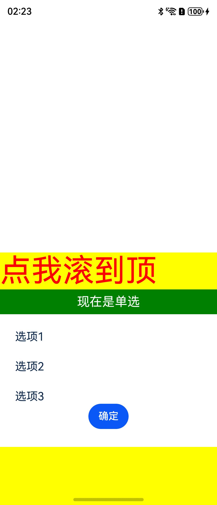

# 说明
这是创建自定义Fabric组件（包括CAPI组件和ArkTS组件）的demo工程。


## 目录结构

```md
FabricComponentSample
├── ReactProject 前端工程
├── fabric-component-sample-package RN三方件（自定义Fabric组件）
├── NativeProject 鸿蒙工程
├── react-native-harmony RN鸿蒙化包
├── react-native-harmony-cli RN鸿蒙化手脚架
└── README.md
```


## 环境搭建
1. 在 `fabric-component-sample-package` 中运行 **npm pack** 生成tgz文件；
2. 在 `ReactProject` 目录下执行 **npm i @react-native-oh/react-native-harmony@x.x.x**或**yarn add @react-native-oh/react-native-harmony@x.x.x** 安装依赖;
3. 在 `entry` 目录下执行 **ohpm i @rnoh/react-native-openharmony@x.x.x** 安装依赖；
4. 回到 `ReactProject` 目录执行 **npm run dev** 生成 bundle，运行 **npm start** 启动metro服务；
5. 检查 `NativeProject`、`entry` 目录下是否生成 `oh-modules` 文件夹；
6. 用 DevEco Studio 打开 `NativeProject`，执行 **Sync and Refresh Project**；
7. 点击 File > Project Structure > Signing Configs，登录并完成签名；
8. 点击右上角的 **run** 启动项目；
9. 如果启动的是metro服务，还需要运行 `hdc rport tcp:8081 tcp:8081` 来转发8081端口，然后再在手机上重新打开应用。

## 效果预览
启动后页面效果如下：



1. 点击【点我滚到顶】按钮，弹窗会滚到顶部；
1. 弹窗会滚到顶部后向下拉，会根据滚动位置决定最终停留在中间还是回到顶部；
1. 点击【选项1/2/3】，选项右侧会显示选中状态；
1. 点击【确定】按钮，会在VSCode控制台打印对应选项的value，如：`{"target": 14, "value": [1]}`；
1. 点击【现在是单选】按钮，按钮文案会改成【现在是多选】，继续点击【选项1/2/3】，可以让多个选项切换到选中状态；
1. 点击【确定】按钮，会在VSCode控制台打印对应选项的value，如：`{"target": 14, "value": [1,2]}`；