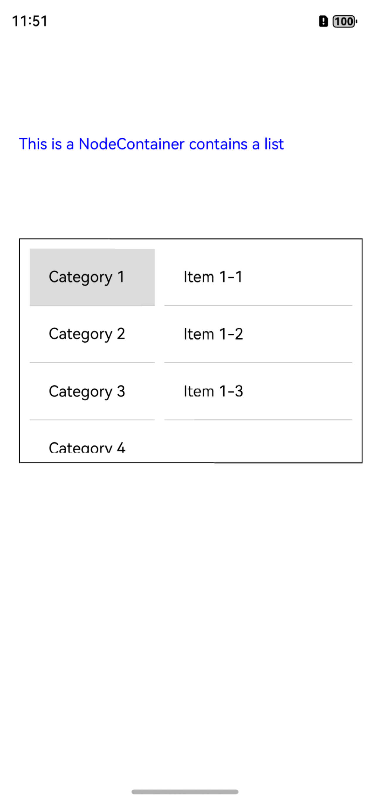

# 说明

这是一个使用 FrameNode 进行 bundle 预加载的 demo 工程。

# 目录结构

GenerateBundle -- RN 侧工程  
FrameNodeSampleApp -- 原生工程

# 环境搭建

1. 在 `GenerateBundle` 目录下执行 **npm i @react-native-oh/react-native-harmony@x.x.x**或**yarn add @react-native-oh/react-native-harmony@x.x.x** 安装依赖，执行 **npm run dev** 生成 bundle；
2. 在 `entry` 目录下执行 **ohpm i @rnoh/react-native-openharmony@x.x.x** 安装依赖；
3. 检查 `FrameNodeSampleApp`、`entry` 目录下是否生成 `oh-modules` 文件夹；
4. 用 DevEco Studio 打开 `FrameNodeSampleApp`，执行 **Sync and Refresh Project**；
5. 点击 File > Project Structure > Signing Configs，登录并完成签名；
6. 点击右上角的 **run** 启动项目。

# 效果预览
在成功运行demo工程之后，打开应用如下图所示：

**RN 分列列表bundle预加载**
操作：点击首页中间的按钮，跳转到新页面中，框内加载出RN bundle中的分列列表。
效果：如下图所示

