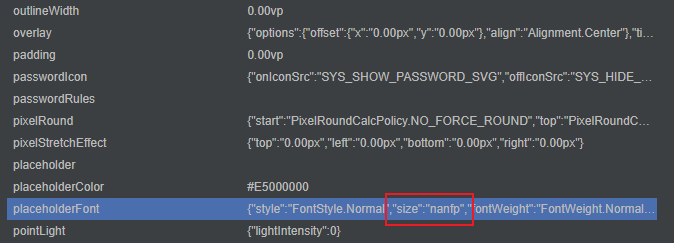
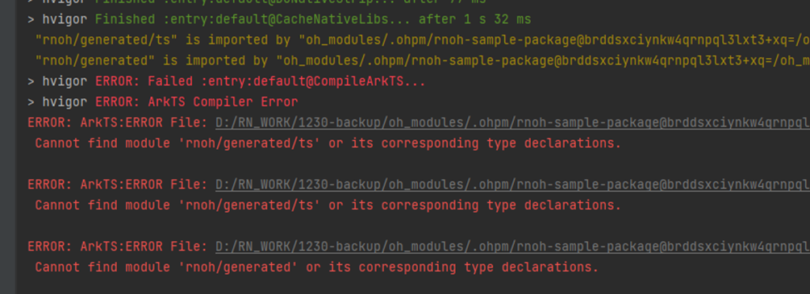

# FAQ

## 版本升级

### React Native 升级到 0.72.5 版本

请参考[RN升级变更整理](RN升级变更整理.md)，在此文档中，梳理了 React Native 0.59版本到0.72.5版本的主要修改点，您可以根据此文档修改您的代码，并升级 React Native 的版本。

## 常见报错

### 常见属性效果设置不正确的时候排查方法

1. 打开位于 DevEco Studio 底部的`ArkUI Inspecetor`，选择出现问题的应用，具体的使用方法可以参考[布局分析](https://developer.huawei.com/consumer/cn/doc/harmonyos-guides/ide-arkui-inspector-0000001605524877)：
   
2. 在打开的页面上找到出现问题的组件，如果组件没有显示出来，也可以使用页面左侧的组件树，根据Text文本，组件类型，tag（如果没有设置过nativeId等属性，会默认设置为id）等信息，找到对应的组件。
3. 选中该组件，在页面右侧打开的属性中查看属性，并找到出现问题的属性。  
   
4. 根据属性，判断原因：
   - ArkUI无法处理该异常值，需要适配处理；
   - 传入的值存在错误，需要找到哪里传的值是错误的。
5. 传入的属性值有两个来源：
   - 通过对组件树进行操作，修改组件的属性。可以在`src/main/cpp/RNOH/SchedulerDelegateCAPI.h`中的`handleMutation`函数中打印对应的操作，可以在这里判断组件是否创建顺序存在问题。
   - 通过Animated的NativeDriver修改组件的属性，可以在`src/main/cpp/RNOH/SchedulerDelegateCAPI.cpp`中的`synchronouslyUpdateViewOnUIThread`函数中打印修改的属性，进一步的判断到底是哪一步出现了问题。
   - 这两种方式都会走到`xxxComponentInstance`的`onPropsChanged`中，也可以在这里打印对应的属性，通过`getTag`可以获取当前组件的tag信息，进而根据属性信息定位问题。
6. 根据出现问题的属性，进一步判断问题的原因，并进行对应的修改。
7. 如果存在闪退的情况，可以参考FAQ中的闪退进行排查。如果非常见问题，可以参考[CppCrash故障定位指导](https://developer.huawei.com/consumer/cn/doc/harmonyos-guides/bpta-cppcrash-guidance)进行分析。

### 常见图片加载不出来的时候排查方法

1. 检查本地图片加载和沙箱图片加载的路径是否正确
   当前本地加载图片和沙箱加载图片的路径采用不同的编码方式，本地加载的图片资源会从rawfile/assets目录下开始找对应的资源，需要将图片资源放在assets目录下；沙箱加载的图片则是会从bundle同级目录直接寻找图片，不需要额外增加一层assets目录。
2. 检查图片的名称与加载的图片名称是否一致
   - 可以在`src/main/cpp/RNOHCorePackage/ComponentInstances/ImageComponentInstance.cpp`中的`onPropsChanged`中打印传过来的图片资源的路径与文件名信息，并与assets目录或者沙箱目录中的图片进行比对，需要保证这两个地方是一致的。
   - 如果这两个地方不一致，需要确认下在自定义打包指令的时候，是否使用了`copyAssets`相关操作，如果没有，需要补充这部分内容，来保证图片资源文件路径格式与bundle中编码的图片资源一致。
3. 基于[常见属性效果设置不正确的时候排查方法](#常见属性效果设置不正确的时候排查方法)，排查是否是哪个属性导致的图片无法加载。

### 编译时报错，找不到TextLayoutManager

编译CPP的时候报错，在报错信息中搜索`error`，发现是`TextLayoutManager.cpp`文件找不到了，报错信息如下：  


该问题是由于工程的路径太长导致的，请缩短工程的路径。

### 找不到generated等文件

报错信息如下图：



上图报错信息意思是说找不到`react_native_openharmony/generated/ts`文件，`react_native_openharmony/generated`里面的文件是由Codegen生成的，若出现上图错误，可能的原因有2个：

1. 未执行Codegen；
2. Codegen生成的文件未能放到正确的位置。

解决方案如下：

- 方案1：
    Codegen会根据接口声明自动生成cpp和ets代码，生成代码的位置可通过`--cpp-output-path`、`--rnoh-module-path`两个参数调整，这两个参数具体的值可通过对比rn工程与HarmonyOS工程的相对路径得出。
- 方案2：
    先任意指定一下`--cpp-output-path`、`--rnoh-module-path`两个参数的值，然后将生成的generated文件夹分别复制到HarmonyOS工程中（如：ets复制到`entry/oh_modules/react_native_openharmony`中，cpp复制到`entry/src/main/cpp`中）

### 启动后闪退，提示没有设置RNOH_C_API_ARCH

程序编译运行，并且正常安装到手机上，但是一旦运行就闪退。在**DevEco Studio > Log > FaultLog**中查看闪退日志，日志如下：


1. 此报错是CAPI版本的错误，需要您在环境变量中设置`RNOH_C_API_ARCH=1`，重启DevEco Studio，并运行**Build > Clean Project**，重新编译后即可解决。
2. 如果上述设置不生效，可以请删除`.cxx`目录，重新编译运行。
3. 如果上述操作还不生效，可以在您自己的`CMakeLists.txt`中设置：

    ```CMAKE
    set(RNOH_C_API_ARCH, 1)
    ```
4. 其余闪退问题可以参考[CppCrash故障定位指导](https://developer.huawei.com/consumer/cn/doc/harmonyos-guides/bpta-cppcrash-guidance)进行分析。

### 打包时或启动Metro时报错，找不到DrawerLayoutAndroid

当打包或者运行Metro服务的时候，报`None of these files exist`，报错截图如下：


该问题是没有配置HarmonyOS打包参数导致的，请参考[如何配置HarmonyOS打包参数](#如何配置harmonyos打包参数)，配置完成后重新打包。

### 找不到HiTrace编译选项

报错信息如下图：


该问题是编译选项中没有设置`WITH_HITRACE_SYSTRACE`为`1`导致的，您可以在CMakeLists中添加该编译选项，需要注意的是，设置`WITH_HITRACE_SYSTRACE`编译选项需要写在`add_subdirectory()`之前，否则将不会生效：

```CMAKE
# CMakeLists.txt
···
set(WITH_HITRACE_SYSTRACE 1)
add_compile_definitions(WITH_HITRACE_SYSTRACE)

add_subdirectory(...)
···
```

### react-native不是内部或外部命令


该问题为`npm install`的时候存在问题，请确认`package.json`的正确性，并重新执行以下命令：

```PowerShell
npm install
```

### MAC环境下Cannot find module ‘@react-native/babel-preset’


该问题是从编辑器复制创建工程命令的时候，添加了多余的符号导致的。您可以将复制的命令格式化之后再执行，或者手动输入创建工程的命令。

### 混合方案闪退时报错insertChild


当使用功能混合方案的时候遇到闪退，闪退的调用栈中存在`ComponentInstance::insertChild`的调用栈，需要排查创建`RNInstance`的时候，`CustomRNComponentFrameNodeFactory`是否被正确创建。需要正确创建该工厂方法，或升级RNOH版本来解决。
