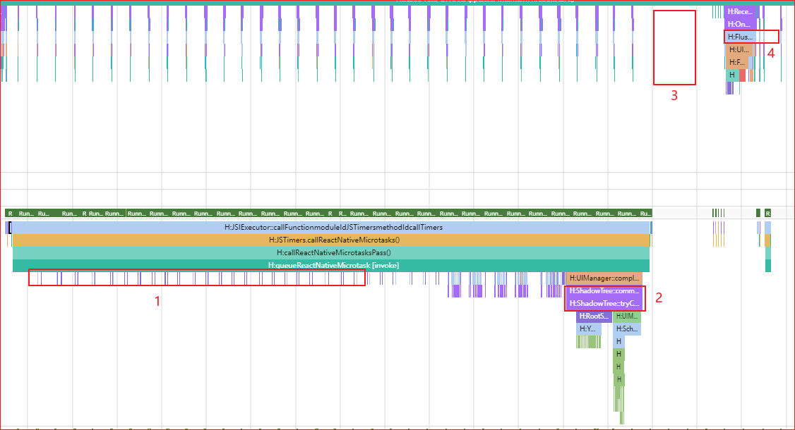

# 性能调优

## 页面生命周期管理

在`RNAbility`中为开发者提供了`onBackground`和`onForeground`接口用于监听页面的生命周期管理。这两个接口默认会在应用切换前台和后台的时候调用，但是对于页面间的路由，需要开发者自行适配。
由于当前HarmonyOS的页面路由存在`router`和`Navigation`两种方式，所以页面的生命周期管理也需要两种不同的适配方式：

- `router`中的适配方式：
    1. 在 `@Entry` 装饰的页面中，引入`RNAbility` 类:

        ```TypeScript
        import {RNAbility} from '@rnoh/react-native-openharmony';
        ...
        @Entry
        @Component
        export struct ComponentName{
        @StorageLink('RNAbility') rnAbility: RNAbility | undefined = undefined
        ...
        }
        ```

    2. 在生命周期 `onPageShow`和 `onPageHide`中调用 `rnAbility?.onForeground()` 和 `rnAbility?.onBackground()`:

        ```TypeScript
        onPageShow(){
            this.rnAbility?.onForeground();
        }
        onPageHide(){
            this.rnAbility?.onBackground();
        }
        ```

- `Navigation`中的适配方式;
    1. 在具有 `NavDestination` 的自定义组件中，引入`RNAbility`  类，该步骤同 `router` 路由。

    2. 在 `NavDestination` 的`onShown`回调事件中调用`rnAbility?.onForeground()`，`在onHidden`事件中调用 `rnAbility?.onBackground()`。

        ```TypeScript
        ...
        build(){
            NavDestination(){
            ...
            }
            .onShown(() => {
            this.rnAbility?.onForeground();
            })
            .onHidden(() =>{
            this.rnAbility?.onBackground();
            })
        }
        ```

## 页面监控

使用Trace进行性能调优的时候，需要注意一下前置条件：

- 使用的hap包要为release的版本，而不是debug的版本；
- bundle要为字节码的形式，也就是在打bundle的时候设置`dev=false`。

### 内存监控

React Native for OpenHarmony使用`onMemoryLevel`用于监听程序内存的状态，当内存占用率高的时候，会自动触发程序的GC，释放内存。保障程序的正常运行。

### bundle加载完毕监控

1. 在代码中，可以通过`rnInstance.getBundleExecutionStatus(bundleURL: string)`方法，来获取指定url的bundle的加载状态，当获取到的状态为`"DONE"`的时候，表明当前的bundle已经加载完成，如：

    ```TypeScript
    rnInstance.getBundleExecutionStatus(jsBundleProvider?.getURL());
    if (jsBundleExecutionStatus === "DONE") {
        ···
    }
    ```

2. 也可以使用Trace的[调优](https://developer.huawei.com/consumer/cn/doc/harmonyos-guides-V5/bpta-optimization-overview-0000001869609160-V5)方式，监控bundle加载完毕的时机。通过[Smartperf-Host](https://docs.openharmony.cn/pages/v4.1/zh-cn/device-dev/device-test/smartperf-host.md)工具打开Trace，并在在Trace中搜索`loadBundle`，即可跳转到对应的进程的`RNOH_JS`线程的对应位置（如图片中的`com.rnoh.tester`）：


### 页面首帧监控

可以使用Trace的[调优](https://developer.huawei.com/consumer/cn/doc/harmonyos-guides-V5/bpta-optimization-overview-0000001869609160-V5)方式，监控页面首帧加载完毕的时机。通过[Smartperf-Host](https://docs.openharmony.cn/pages/v4.1/zh-cn/device-dev/device-test/smartperf-host.md)工具打开Trace，按照以下的特征便可以找到首帧加载的时间：

- `loadBundle`已经完成；
- 在**1**处，可以看到在`RNOH_JS`线程上，构造节点树的相关操作，如`cloneNode`等;
- 在**2**处，可以看到`ShadowTree::commit`，完成渲染流程中的提交；
- 在**3**处，虽然没有Trace打出来，但是并不代表这里线程空置，在一段时间中进行了组件`ComponentInstance`创建的操作；
- 在**4**处，在主线程上调用系统的原生API：`FlushVsync`，刷新视图同步事件，包括记录帧信息、刷新任务、绘制渲染上下文，完成最终的渲染操作。


