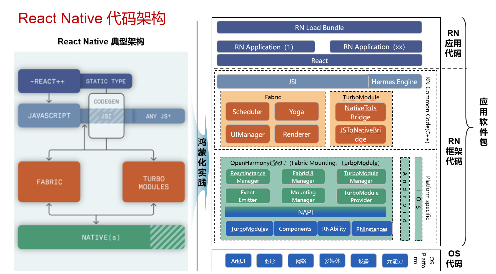
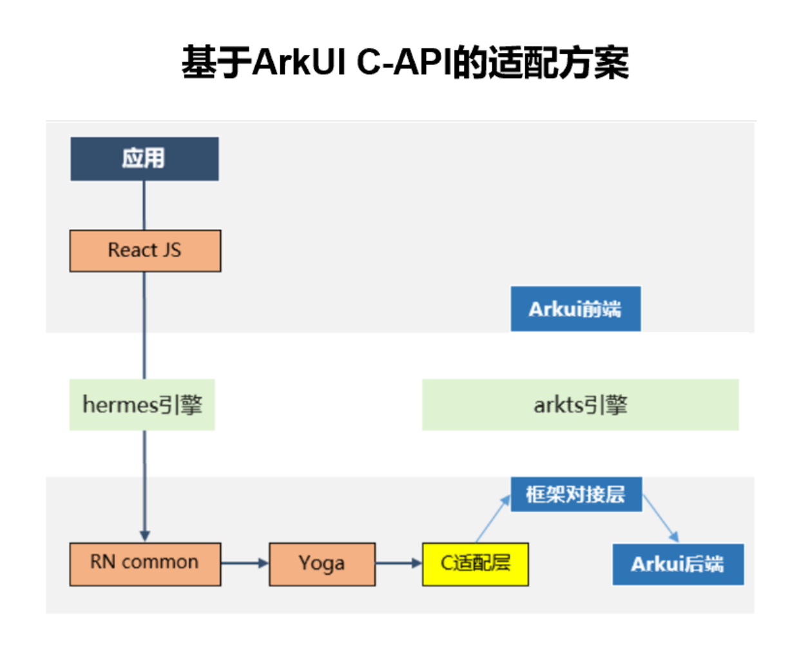

# 架构介绍

关于RN的架构，可以参考[React Native中文网](https://reactnative.cn/architecture/overview)。



如图，React Native for OpenHarmony 在 React Native 的新架构（0.68以及之后的版本）的基础上，进行了鸿蒙化的适配。按照功能可以进行如下的划分：

- RN 应用代码：开发者实现的业务代码。
- RN 库代码：在 React Native 供开发者使用的组件和API的封装与声明。
- JSI（JavaScript Interface）：JavaScript 与 CPP 之间进行通信的API。
- React Common：所有平台通用的 CPP 代码，用于对 RN 侧传过来的数据进行预处理。
- OpenHarmony 适配代码：接收并处理 React Common 传过来的数据，对接原生的代码，调用 ArkUI 的原生组件与 API。主要包括了两个部分：分别是 TurboModule 与 Fabric。
- OS代码：对接系统底层功能，根据适配层代码传过来的数据进行渲染，或完成对应的功能。

## RN 库代码

- 在现行的 React Native 中，有很多属性是在React侧完成的封装，也有很多属性是平台独有的。为了达成这个效果，React Native 在JS侧根据`Platform`增加了很多判断。所以，React Native 的鸿蒙化适配也需要增加`HarmonyOS`相关的平台判断，与相应的组件属性的封装。为此，鸿蒙化团队提供了`react-native-harmony`的tgz包，并通过更改`metro.config.js`配置，将该tgz包应用到 Metro Bundler中。
- React Native 还提供了很多库的封装，例如Codegen、打包工具等。为此，鸿蒙化团队提供了`react-native-harmony-cli`的包，对这些库进行了`HarmonyOS`平台的适配，用于向开发者提供相关的功能。

## Fabric

Fabric 是 React Native 的组件渲染系统。接收 React Native 传过来的组件信息，处理后发送给原生OS，由OS完成页面的渲染。



在适配方案中，组件不通过复杂的流程对接到ArkUI的声明式范式上，而是直接使用[XComponent](#c-api版本xcomponent接入)对接到ArkUI的后端接口进行渲染，缩短了流程，提高了组件渲染的效率。C-API的性能收益包括以下的几个部分：

- C端最小化、无跨语言的组件创建和属性设置；
- 无跨语言前的数据格式转换，不需要将`string`，`enum`等数据类型转换为`object`，可以在CPP侧直接使用对应的数据进行处理；
- 可以进行属性Diff，避免重复设置，降低了属性设置的开销。

## TurboModule


TurboModule 是 React Native 中用于 JavaScript 和原生代码进行交互的模块，为RN JS应用提供调用系统能力的机制。根据是否依赖 HarmonyOS系统相关的能力，可以分为两类：cxxTurboModule和ArkTSTurboModule。

1. ArkTSTurboModule：
    - ArkTSTurboModule为 React Native 提供了调用ArkTS原生API的方法。可以分为同步与异步两种。
    - ArkTSTurboModule依赖NAPI进行原生代码与CPP侧的通信。包括JS与C之间的类型转换，同步和异步调用的实现等。
2. cxxTurboModule：
    - cxxTurboModule主要提供的是不需要系统参与的能力，例如`NativeAnimatedTurboModule`主要提供了数据计算的相关能力。
    - cxxTurboModule不依赖于系统的原生API，为了提高相互通信的效率，一般是在cpp侧实现，这样可以减少native与cpp之间的通信次数，提高性能。

## XComponent接入


CAPI 版本使用XComponent总共分成了两个步骤：

1. `createSurface`的时候创建`XComponentSurface`;
2. `startSurface`的时候将CPP的`XComponentSurface`连接到ArkUI的`Xcomponent`上。

`createSurface`的时候主要做了以下的操作：

1. 创建并将`XComponentSurface`记录到Map中：

    ```CPP
    void RNInstanceCAPI::createSurface(
    facebook::react::Tag surfaceId,
    std::string const& moduleName) {
    m_surfaceById.emplace(
        surfaceId,
        XComponentSurface(
            ···
            surfaceId,
            moduleName));
    }
    ```

2. 在`XComponentSurface`中创建rootView，用于挂载C-API的组件，并在Surface上统一处理Touch事件：

    ```CPP
    XComponentSurface::XComponentSurface(
    ···
    SurfaceId surfaceId,
    std::string const& appKey)
    : 
      ···
      m_nativeXComponent(nullptr),
      m_rootView(nullptr),
      m_surfaceHandler(SurfaceHandler(appKey, surfaceId)) {
    m_scheduler->registerSurface(m_surfaceHandler);
    m_rootView = componentInstanceFactory->create(
        surfaceId, facebook::react::RootShadowNode::Handle(), "RootView");
    m_componentInstanceRegistry->insert(m_rootView);
    m_touchEventHandler = std::make_unique<SurfaceTouchEventHandler>(m_rootView);
    }
    ```

`startSurface`的时候主要做了以下的操作：

1. 在ArkTS侧创建`XComponent`，并设置`id`，`type`与`libraryname`属性。其中：
    - id：组件的唯一标识，又由`InstanceID`和`SurfaceID`共同组成，记录了此`XComponent`属于哪一个Instance与Surface；
    - type：`node`，标识该XComponent是一个占位组件，组件的实现都在CAPI侧；
    - libraryname：表示C-API组件在哪个so库中实现，并加载该so库，自动调用该so中定义的`Init`函数。当前React Native for OpenHarmony默认的so名字为`rnoh_app`。

    ```TypeScript
    XComponent({
        id: this.ctx.rnInstance.getId() + "_" + this.surfaceHandle.getTag(),
        type: "node",
        libraryname: 'rnoh_app'
    })
    ```

2. 在CPP侧的`Init`中调用`registerNativeXComponent`函数，该函数中调用了`OH_NativeXComponent_GetXComponentId`用于获取ArkTS设置的id，并根据id找到对应的Instance与Surface。同时还要获取`nativeXComponent`对象，记录ArkTS侧的`XComponent`。

    ```CPP
    if (OH_NativeXComponent_GetXComponentId(nativeXComponent, idStr, &idSize) !=
      OH_NATIVEXCOMPONENT_RESULT_SUCCESS) {
        ···
    }
    std::string xcomponentStr(idStr);
    std::stringstream ss(xcomponentStr);
    std::string instanceId;
    std::getline(ss, instanceId, '_');
    std::string surfaceId;
    std::getline(ss, surfaceId, '_');
    ```

3. 调用`OH_NativeXComponent_AttachNativeRootNode`，将`XComponentSurface`中记录的rootView连接到ArkTS侧的`XComponent`上：

    ```CPP
    OH_NativeXComponent_AttachNativeRootNode(
        nativeXComponent,
        rootView.getLocalRootArkUINode().getArkUINodeHandle());
    ```
4. 将rootView连接到`XComponent`后，rootView就作为CAPI组件的根节点，后续的子孙节点通过Mutation指令逐个插入到组件树上。