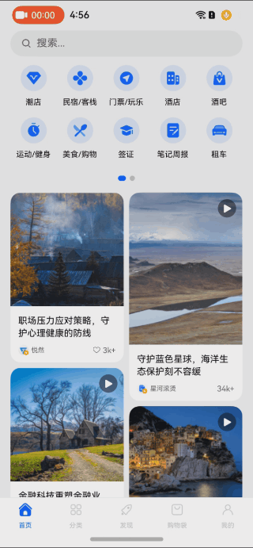

# Introduction
This example demonstrates a common scenario in app development: a high-performance waterfall flow page, implemented using the RN framework. It leverages techniques like on-demand rendering and component reuse.

## Running Effect Screenshot
Page Layout: The page consists of a top search bar, a functional area, and a waterfall layout. The waterfall layout contains live video cards, image cards, and video cards.


**Operation Process:**

**Operation Process:**

1. Ensure the phone is successfully connected to the network;
2. **Pull-to-refresh the page:**
   - **Step:** Perform a pull-down refresh operation when the waterfall layout is at the top.
   - **Effect:** Trigger a network request, display a loading animation, and once the data is loaded, hide the loading animation and refresh the page content.
3. **Pull-up to load more:**
   - **Step:** Perform a pull-up to load more operation to trigger a network request.
   - **Effect:** Display the loading animation and prompt "- loading, please wait -". After the data loading is complete, hide the loading animation and loading prompt and display more card content.
4. **Auto-play live video cards:**
   - **Step:** Scroll the waterfall layout to fully display the live video card.
   - **Effect:** The live video card will automatically start playing.
5. **Quickly return to the top of the page:**
   - **Action:** Click the bottom Home Tab.
   - **Effect:** The page will automatically scroll back to the top.

## Scene Implementation
For a detailed implementation, please refer to [High-Performance Waterfall Flow Page with RN Framework](https://developer.huawei.com/consumer/cn/forum/topic/0202160237461682658).

# Project Directory

```
home-fluency
├── RNHomeFluency   Frontend Project
└── HomeFluency     Native Project
```

# Installation Guide
1. Replace the version of `@react-native-oh/react-native-harmony` in `RNHomeFluency/package.json`, as well as `@rnoh/react-native-openharmony` in `HomeFluency/oh-package.json5` and `HomeFluency/entry/oh-package.json5` (optional: upgrade the version);
2. In `RNHomeFluency`, run **npm i --force** to install dependencies, then run **npm run dev** to generate the bundle file, and **npm start** to start the Metro service;
3. Open `HomeFluency` in DevEco Studio, execute **Sync and Refresh Project**, and copy and replace `RNHomeFluency/HomeFluency/entry` into `HomeFluency/entry`;
4. Return to DevEco Studio, delete the `.cxx` and `build` directories under `HomeFluency/entry`, and click the **Run** button on the top right to start the project;
5. If running with Metro service, you need to execute `npm run start` in RNHomeFluency and then reopen the application on the device.
