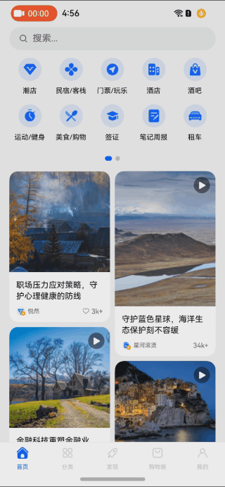

# 介绍
本示例针对应用开发中相当常见的瀑布流页面场景，基于按需渲染、组件复用等技术，使用RN框架实现了高性能瀑布流页面。

## 效果预览
（页面由顶部搜素框，功能区，瀑布流，瀑布流卡片由直播卡片、图片卡片、视频卡片组成）





**操作流程：**
1. 确保手机已成功接入网络；
2. 下拉刷新页面
    - 步骤：当瀑布流位于顶部时，执行下拉刷新操作。
    - 效果：
触发网络请求，展示加载动画，数据加载完成后隐藏加载动画并刷新页面内容。
3. 上拉加载更多
    - 步骤：执行上拉加载更多操作，触发网络请求。
    - 效果：
展示加载动画并提示“——加载中，请稍后——”，数据加载完成后隐藏加载动画和加载提示并展示更多卡片内容。
4. 自动播放直播卡片 
    - 步骤：滑动瀑布流内容区，让直播卡片完整显示。
    - 效果：
直播卡片自动开始播放；
5. 快速回到页面顶部。
    - 操作：点击底部首页 Tab 。
    - 效果：页面自动滚动回到顶部。

## 场景实现
详细场景实现，请参考[基于RN框架实现高性能瀑布流页面](https://developer.huawei.com/consumer/cn/forum/topic/0202160237461682658)。

# 工程目录
```
home_fluency
├── RNHomeFluency 前端工程
└── HomeFluency 原生工程
```

# 安装教程
1. 替换 RNHomeFluency/package.json 中的 @react-native-oh/react-native-harmony 版本 以及 HomeFluency/oh-package.json5 和 HomeFluency/entry/oh-package.json5 中的 @rnoh/react-native-openharmony 版本 （可选：升级版本）；
2. 在 RNHomeFluency 中，运行 npm i --force 安装依赖，然后运行 npm run dev 生成打包文件；
3. 在 DevEco Studio 中打开 HomeFluency，执行 同步并刷新项目，然后将 RNHomeFluency/HomeFluency/entry 复制并替换到 HomeFluency/entry；
4. 返回 DevEco Studio，删除 HomeFluency/entry下的 .cxx 和 build 目录，点击右上角的 运行 按钮启动项目；
5. 如果使用 Metro 服务运行，需要在 RNHomeFluency 中执行 npm run start，然后重新打开设备上的应用。