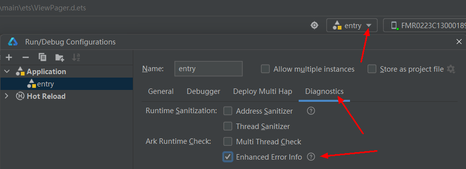

# 运行类FAQ

## 启动后闪退，提示没有设置RNOH_C_API_ARCH
- 查看闪退日志  
程序编译运行，并且正常安装到手机上，但是一旦运行就闪退。在 **DevEco Studio > Log > FaultLog** 中查看闪退日志。
- 出错截图  

- 解决
1. 此报错是 **CAPI** 版本的错误，需要您在环境变量中设置 `RNOH_C_API_ARCH=1`，重启 DevEco Studio，并运行 **Build > Clean Project**，重新编译后即可解决。
2. 如果上述设置不生效，可以请删除 `.cxx` 目录，重新编译运行。
3. 如果上述操作还不生效，可以在您自己的 `CMakeLists.txt` 中设置：

    ```CMAKE
    set(RNOH_C_API_ARCH, 1)
    ```
4. 其余闪退问题可以参考[CppCrash故障定位指导](https://developer.huawei.com/consumer/cn/doc/best-practices-V5/bpta-cppcrash-guidance-V5)进行分析。

### 混合方案闪退时报错insertChild
- 错误截图  

- crash  
当使用功能混合方案的时候遇到闪退，闪退的调用栈中存在 `ComponentInstance::insertChild` 的调用栈，需要排查创建 `RNInstance` 的时候，`CustomRNComponentFrameNodeFactory` 是否被正确创建。需要正确创建该工厂方法，或升级 **RNOH** 版本来解决。

### 混合方案闪退时报错：Cannot read property tag of undefined
- 错误截图  
    
- crash
当使用混合方案的时候遇到闪退，闪退的调用栈栈底显示 `CustomRNComponentFrameNodeFactory` 中时，需要排查一下是否在创建 `RNApp` 或 `RNInstance` 的时候，将组件的name放到数组中，并作为 `arkTsComponentNames` 的参数传入。

### 运行后报错：Coundn't create bindings between ETS and CPP. libRNOHApp is undefined.
 
- 现象
    
    运行 **RN** 应用时，Crash，FaultLog 提示：`Error message: Coundn't create bindings between ETS and CPP. libRNOHApp is undefined`。
 
- 原因
 
    `libRNOHApp` 库实际对应的库是 `librnoh_app.so` 动态库，是 C++ 编译的动态库产物，报上述错误的原因有 2 个：
        
    - 原因 1：`librnoh_app.so` 确实没有。
    - 原因 2：有，定位其他原因。
 
- 解决
 
    确定 `librnoh_app.so` 是否有,可以去鸿蒙工程根目录  `\entry\build\default\intermediates\libs\default\arm64-v8a\` 下查找是否有对应 so;或者去鸿蒙工程根目录 `\entry\build\default\outputs\default\XXX.hap` 包中的 `libs/arm64-v8a` 中查找是否有对应so。
 
    - 原因 1 解决方案：需要编辑配置文件 `entry/build-profile.json5`，在 buildOptions 下补充 `externalNativeOptions` 选项：
 
        ```json5
        "buildOption": {
            "externalNativeOptions": { // native编译配置选项
                "path": "./src/main/cpp/CMakeLists.txt",  // native层对应的CMakeLists.txt
                "arguments": "",
                "cppFlags": "",            
            }                
        }
        ```
    - 原因 2 解决方案：
        
        （1）需要查看 Hilog 日志确定具体问题，一个可能的原因是 `libhermes.so` 没有打包到 XXX.hap 包中引起的（Hilog 日志报：`can't find library libhermes.so in namespace: moduleNs_default`）。
        
        （2）或者打开 **IDE** 的错误增强功能，参考下图：
             
 
        （3）因为 **IDE** 升级，需要开发者修改适配，修改适配可参考[文档](https://developer.huawei.com/consumer/cn/doc/harmonyos-releases-V5/ide-changelogs-db5-V5)，简单说就是：2 个 har 包，har 包 A 的 so 依赖了 har 包 B 的 so，以前，har 包 A 会打包 Har 包 B 的 so 到的 har 包 A 里，修改适配之后，则不会。
 
        （4）解决：自动解决（需要升级 IDE 到最新版本）
 
        har 模块 `/build-profile.json5` 中增加：
        ```json5
        （modules.json5中type=har）
            "nativeLib": { // apiType字段同级别
            "excludeFromHar": false
            }    
        ```
        **参数说明详见**[文档](https://developer.huawei.com/consumer/cn/doc/harmonyos-guides-V5/ide-hvigor-build-profile-V5)。
 
        手动解决：需要将 **RN** 源码目录 `oh_modules/@rnoh/react-native-openharmony/src/main/cpp/third-party/prebuilt` 下的内容整体拷贝到 `oh_modules/@rnoh/react-native-openharmony/libs` 目录下。
