# 性能调优

## 页面生命周期管理

在 `RNAbility` 中为开发者提供了 `onBackground` 和 `onForeground` 接口用于监听页面的生命周期管理。这两个接口默认会在应用切换前台和后台的时候调用，但是对于页面间的路由，需要开发者自行适配。
由于当前 OpenHarmony 的页面路由存在 `router` 和 `Navigation` 两种方式，所以页面的生命周期管理也需要两种不同的适配方式：

- `router` 中的适配方式：
    1. 在 `@Entry` 装饰的页面中，引入 `RNAbility` 类：

        ```typescript
        import {RNAbility} from '@rnoh/react-native-openharmony';
        ...
        @Entry
        @Component
        export struct ComponentName{
        @StorageLink('RNAbility') rnAbility: RNAbility | undefined = undefined
        ...
        }
        ```

    2. 在生命周期 `onPageShow` 和 `onPageHide` 中调用 `rnAbility?.onForeground()` 和 `rnAbility?.onBackground()`：

        ```typescript
        onPageShow(){
            this.rnAbility?.onForeground();
        }
        onPageHide(){
            this.rnAbility?.onBackground();
        }
        ```

- `Navigation` 中的适配方式;
    1. 在具有 `NavDestination` 的自定义组件中，引入 `RNAbility` 类，该步骤同 `router` 路由。

    2. 在 `NavDestination` 的 `onShown` 回调事件中调用 `rnAbility?.onForeground()`，在 `onHidden` 事件中调用 `rnAbility?.onBackground()`：

        ```javascript
        ...
        build(){
          NavDestination(){
          ...
          }
          .onShown(() => {
          this.rnAbility?.onForeground();
          })
          .onHidden(() =>{
          this.rnAbility?.onBackground();
          })
        }
        ```

## 页面监控

使用 Trace 进行性能调优的时候，需要注意一下前置条件：

- 使用的 hap 包要为 release 的版本，而不是 debug 的版本；
- bundle 要为字节码的形式，也就是在打 bundle 的时候设置 `dev=false`。

### 内存监控

React Native for OpenHarmony 使用 `onMemoryLevel` 用于监听程序内存的状态，当内存占用率高的时候，会自动触发程序的 GC，释放内存。保障程序的正常运行。

### bundle加载完毕监控

1. 在代码中，可以通过 `rnInstance.getBundleExecutionStatus(bundleURL: string)` 方法，来获取指定 url 的 bundle 的加载状态，当获取到的状态为 `"DONE"` 的时候，表明当前的 bundle 已经加载完成，如：

    ```typescript
    rnInstance.getBundleExecutionStatus(jsBundleProvider?.getURL());
    if (jsBundleExecutionStatus === "DONE") {
      ···
    }
    ```

2. 也可以使用 Trace 的[调优](https://developer.huawei.com/consumer/cn/doc/harmonyos-guides-V5/bpta-optimization-overview-0000001869609160-V5)方式，监控bundle加载完毕的时机。通过[Smartperf-Host](https://gitee.com/openharmony-sig/smartperf#smartperf-host)工具打开 Trace，并在在 Trace 中搜索 `loadBundle`，即可跳转到对应的进程的 `RNOH_JS` 线程的对应位置（如图片中的`com.rnoh.tester`）：


### 页面首帧监控

可以使用 Trace 的[调优](https://developer.huawei.com/consumer/cn/doc/harmonyos-guides-V5/bpta-optimization-overview-0000001869609160-V5)方式，监控页面首帧加载完毕的时机。通过[Smartperf-Host](https://gitee.com/openharmony-sig/smartperf#smartperf-host)工具打开 Trace，按照以下的特征便可以找到首帧加载的时间：

- `loadBundle` 已经完成；
- 在 **1** 处，可以看到在 `RNOH_JS` 线程上，构造节点树的相关操作，如 `cloneNode` 等；
- 在 **2** 处，可以看到 `ShadowTree::commit`，完成渲染流程中的提交；
- 在 **3** 处，虽然没有 Trace 打出来，但是并不代表这里线程空置，在一段时间中进行了组件 `ComponentInstance` 创建的操作；
- 在 **4** 处，在主线程上调用系统的原生 API：`FlushVsync`，刷新视图同步事件，包括记录帧信息、刷新任务、绘制渲染上下文，完成最终的渲染操作。


#### 在线监控RN页面的性能指标FCP
开发者可以通过以下方式在原生侧获取RN页面首帧监控能力，用于性能优化。下列是两种实现方式，分别是将`mount`事件、`onLayout`事件的触发时间作为监控RN页面的首帧时间，由开发者自由选择。
  
下图表示的是在trace上`mount`事件、`onLayout`事件和首帧的位置关系：
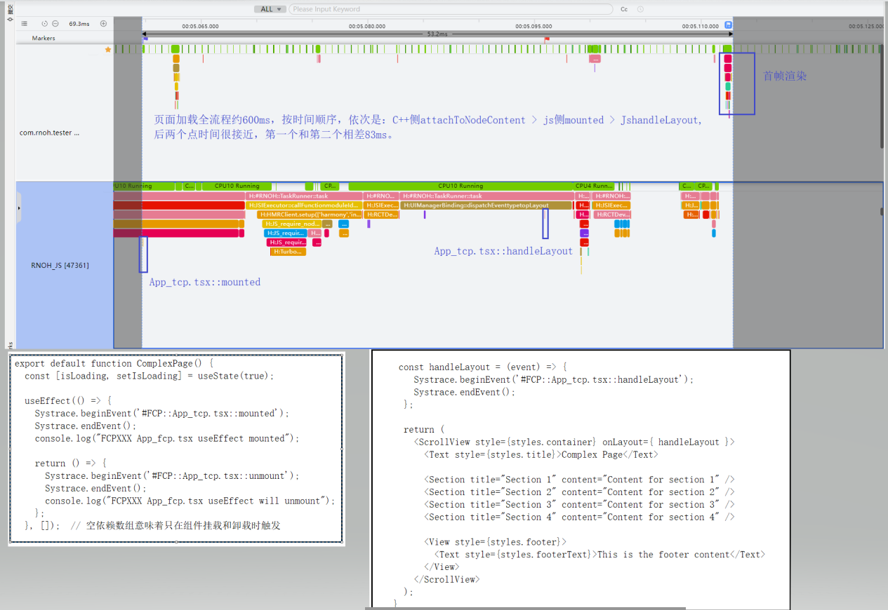
  
  > 注意事项：`mount`事件和`onLayout`事件的触发时间与真正首帧时间相差都在200ms以内。

- 方式1：React JS侧监控页面`mount`事件作为FCP的标志。

    在ReactNative工程的代码中实现如下代码：
    ```TypeScript
    import React, { useState, useEffect } from 'react';
    import { ScrollView, Text, View, StyleSheet} from 'react-native';

    const Section = ({ title, content }) => (
        <View style={styles.section}>
            <Text style={styles.sectionTitle}>{title}</Text>
            <Text style={styles.sectionContent}>{content}</Text>
        </View>
    );


    export default function ComplexPage() {
        const [isLoading, setIsLoading] = useState(true);

        useEffect(() => {
            // 此处是页面mount标志，可以调用自定义TurboModule上报到原生侧作为FCP标志
            return () => {
            };
        }, []); 

        return (
            <ScrollView style={styles.container} >
            <Text style={styles.title}>Complex Page</Text>

            <Section title="Section 1" content="Content for section 1" />
            <Section title="Section 2" content="Content for section 2" />
            <Section title="Section 3" content="Content for section 3" />
            <Section title="Section 4" content="Content for section 4" />
            
            <View style={styles.footer}>
                <Text style={styles.footerText}>This is the footer content</Text>
            </View>
            </ScrollView>
        );
        }

        const styles = StyleSheet.create({
        container: {
            flex: 1,
            padding: 16,
            backgroundColor: '#f5f5f5',
        },
        title: {
            fontSize: 24,
            fontWeight: 'bold',
            marginBottom: 16,
            textAlign: 'center',
        },
        section: {
            marginBottom: 20,
            padding: 12,
            backgroundColor: '#fff',
            borderRadius: 8,
        },
        sectionTitle: {
            fontSize: 18,
            fontWeight: '600',
            marginBottom: 8,
        },
        sectionContent: {
            fontSize: 16,
            color: '#666',
        },
        footer: {
            padding: 16,
            backgroundColor: '#fff',
            marginTop: 24,
            borderRadius: 8,
        },
        footerText: {
            textAlign: 'center',
            fontSize: 16,
            color: '#333',
        },
    });
    ```
  >注意事项：JS侧调用[自定义TurboModule](./TurboModule.md)上报页面`mount`事件作为首帧时间，由开发者自行实现。
- 方式2：React JS侧监控页面根节点`onLayout`事件作为FCP的标志。 

    在React Native工程的代码中实现如下代码：
    ```TypeScript
    import React, { useState, useEffect } from 'react';
    import { ScrollView, Text, View, StyleSheet} from 'react-native';

    const Section = ({ title, content }) => (
        <View style={styles.section}>
            <Text style={styles.sectionTitle}>{title}</Text>
            <Text style={styles.sectionContent}>{content}</Text>
        </View>
    );

    export default function ComplexPage() {
        const [isLoading, setIsLoading] = useState(true);

        const handleLayout = (event) => {
            // 此处是页面根节点onLayout回调，可以调用自定义TurboModule上报到原生侧作为FCP标志
        };

        return (
            <ScrollView style={styles.container} onLayout={ handleLayout }>
            <Text style={styles.title}>Complex Page</Text>

            <Section title="Section 1" content="Content for section 1" />
            <Section title="Section 2" content="Content for section 2" />
            <Section title="Section 3" content="Content for section 3" />
            <Section title="Section 4" content="Content for section 4" />
            
            <View style={styles.footer}>
                <Text style={styles.footerText}>This is the footer content</Text>
            </View>
            </ScrollView>
        );
        }

        const styles = StyleSheet.create({
        container: {
        flex: 1,
        padding: 16,
        backgroundColor: '#f5f5f5',
        },
        title: {
        fontSize: 24,
        fontWeight: 'bold',
        marginBottom: 16,
        textAlign: 'center',
        },
        section: {
        marginBottom: 20,
        padding: 12,
        backgroundColor: '#fff',
        borderRadius: 8,
        },
        sectionTitle: {
        fontSize: 18,
        fontWeight: '600',
        marginBottom: 8,
        },
        sectionContent: {
        fontSize: 16,
        color: '#666',
        },
        footer: {
        padding: 16,
        backgroundColor: '#fff',
        marginTop: 24,
        borderRadius: 8,
        },
        footerText: {
        textAlign: 'center',
        fontSize: 16,
        color: '#333',
        },
    });
    ```
  > 注意事项：JS侧调用[自定义TurboModule](./TurboModule.md)上报页面根节点`onLayout`事件作为首帧时间，由开发者自行实现。

### React Marker
#### React Marker介绍

React Marker 的作用是监听 **RN** 应用生命周期的各种事件，主要在下文创建相关事件、包处理相关事件、原生模块注册相关事件 Catalyst 实例创建相关事件、JavaScript 包加载和运行相关事、内容显示相关事件、重载和调试相关事件、下载相关事件等八个核心场景增加打点，使用统一的 tag 输出日志，并添加 trace 点和提供日志，方便开发者分析性能问题。

##### 当前版本支持的React Marker如下所示:
|ReactMarkerId|说明|
|---|---|
|RUN_JS_BUNDLE_START|开始运行JS_Bundle|
|RUN_JS_BUNDLE_STOP|运行JS_Bundle结束|
|CREATE_REACT_CONTEXT_START|创建React上下文开始|
|CREATE_REACT_CONTEXT_STOP|创建React上下文结束|
|NATIVE_MODULE_SETUP_START|原生模块的初始化开始|
|NATIVE_MODULE_SETUP_STOP|原生模块的初始化结束|
|REACT_INSTANCE_INIT_START|开始初始化React实例|
|REACT_INSTANCE_INIT_STOP|停止初始化React实例|
|CONTENT_APPEARED|应用程序中的内容已成功渲染并显示给用户|
|CHANGE_THREAD_PRIORITY|改变线程优先级|
|DOWNLOAD_START|JS_Bundle下载开始|
|DOWNLOAD_END|JS_Bundle下载结束|
|REACT_BRIDGE_LOADING_START|React桥接模块加载开始|
|REACT_BRIDGE_LOADING_END|React桥接模块加载结束|
|INITIALIZE_MODULE_START|React模块初始化开始|
|INITIALIZE_MODULE_END|React模块初始化结束|
|PROCESS_PACKAGES_START|处理JS包开始|
|PROCESS_PACKAGES_END|处理JS包结束|
|CREATE_UI_MANAGER_MODULE_START|创建UI_Manager模块开始|
|CREATE_UI_MANAGER_MODULE_END|创建UI_Manager模块结束|
|CREATE_MODULE_START|创建React模块开始|
|CREATE_MODULE_END|创建React模块结束|
|PROCESS_CORE_REACT_PACKAGE_START|React Native核心包加载开始|
|PROCESS_CORE_REACT_PACKAGE_END|React Native核心包加载结束|
|FABRIC_COMMIT_START|Fabric渲染引擎的提交开始|
|FABRIC_COMMIT_END|Fabric渲染引擎的提交结束|
|FABRIC_FINISH_TRANSACTION_START| Fabric完成事务开始|
|FABRIC_FINISH_TRANSACTION_END|Fabric完成事务结束|
|FABRIC_DIFF_START|Fabric差异计算开始|
|FABRIC_DIFF_END|Fabric差异计算结束|
|FABRIC_LAYOUT_START|Fabric布局开始|
|FABRIC_LAYOUT_END|Fabric布局结束|
|FABRIC_BATCH_EXECUTION_START|Fabric批处理执行开始|
|FABRIC_BATCH_EXECUTION_END|Fabric批处理执行结束|
|FABRIC_UPDATE_UI_MAIN_THREAD_START|Fabric更新UI主线程开始|
|FABRIC_UPDATE_UI_MAIN_THREAD_END|Fabric更新UI主线程结束|

#### React Marker的trace打点操作

当前RNOH默认不在trace中记录React Marker打点，开启这一功能请在 `harmony/entry/src/main/cpp/CMakeLists.txt` 中添加 `add_compile_definitions(WITH_HITRACE_REACT_MARKER=ON)` 配置，具体示例如下：

```diff
...
set(WITH_HITRACE_SYSTRACE 1) # for other CMakeLists.txt files to use
add_compile_definitions(WITH_HITRACE_SYSTRACE)
+ add_compile_definitions(WITH_HITRACE_REACT_MARKER=ON)
set(OH_MODULES_DIR "${CMAKE_CURRENT_SOURCE_DIR}/../../../../oh_modules") # required by 'autolink_libraries'

include("${CMAKE_CURRENT_SOURCE_DIR}/autolinking.cmake")

add_subdirectory("${RNOH_CPP_DIR}" ./rn)
...
```

注意这类设置需要添加在 add_subdirectory 之前才能在子目录中生效。

1、首先抓取对应应用的 trace。
> 注意事项：在应用启动前开始抓取 trace 操作。

2、通过[SmartPerf](https://gitee.com/openharmony-sig/smartperf)打开对应 trace。

  - 以下是应用 trace 的举例说明：
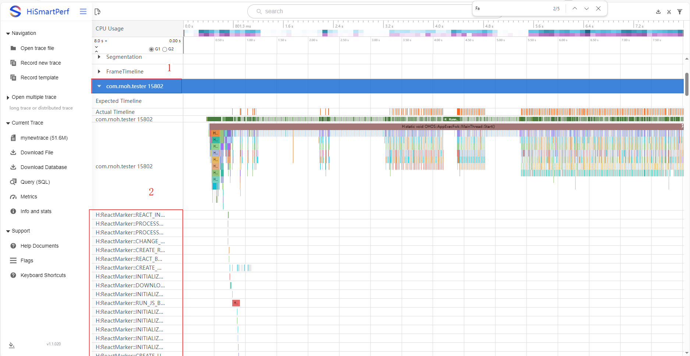
  图中的红色框 1 代表的是应用进程，红色框 2 代表的是应用运行过程中打印出来的 React Marker 信息。  

> 注意事项：在 trace 上打点出来的 React Marker 名称有所区别，例如 `RUN_JS_BUNDLE_START`、`RUN_JS_BUNDLE_STOP` 这两个 React Marker 在 trace 打点上的名称为 `H:ReactMarker::RUN_JS_BUNDLE::tag::<message>`，START 和 STOP 代表的是 trace 上时间条的开始和结束。

#### React Marker的监听实现
> 注意事项：实现 React Marker 的监听功能前提条件：需要[自定义TurboModule的实现](./TurboModule.md)。下列内容也是在该文档的基础上进行编写。
1. 参考[自定义TurboModule的实现](./TurboModule.md)，在鸿蒙工程中创建一个 TurboModule，如果工程中已经存在则执行下一步。

2. 在 React Native 工程 js 侧中的 `NativeCalculator.ts` 文件中声明一个处理 React Marker 事件的方法。
   
   在 `RTNCalculator/src/specs/v2/NativeCalculator.ts` 添加如下代码：
    ```diff
    // NativeCalculator.ts
    import type {TurboModule} from 'react-native/Libraries/TurboModule/RCTExport';
    import {TurboModuleRegistry} from 'react-native';

    export interface Spec extends TurboModule {
      add(a: number, b: number): Promise<number>;
    +  handleReactMarkerEvent(
    +    markerId: string,
    +    tag: string,
    +    timestamp: string,
    +  ): void;
    }

    export default TurboModuleRegistry.get<Spec>(
      'RTNCalculator',
    ) as Spec | null;
   ```
    - handleReactMarkerEvent：这是方法的名称，表示该方法的作用是处理一个与 React Marker 标记相关的事件。  
    - markerId：用来标识 React Marker 特定事件的唯一标识符。  
    - tag：这个参数用于进一步描述 React Marker 事件的类型或来源。  
    - timestamp：表示事件发生的时间，通常用来记录 React Marker 事件的时间戳。
  3. 在 React Native 工程中使用 Codegen 生成原生代码，并将生成的胶水代码拷贝到您的鸿蒙工程中，具体的操作步骤可以参考[自定义TurboModule的实现](./TurboModule.md)。
  4. 在鸿蒙工程的 ArkTS 侧中的 `CalculatorModule.ts` 文件实现处理 React Marker 事件的方法。

     在 `entry/src/main/ets/turbomodule/CalculatorModule.ts` 中添加如下代码：
      ```diff
      // entry/src/main/ets/turbomodule/CalculatorModule.ts
      import { TurboModule } from '@rnoh/react-native-openharmony/ts';
      import { TM } from '@rnoh/react-native-openharmony/generated/ts';

      export class CalculatorModule extends TurboModule implements TM.RTNCalculator.Spec {
        add(a: number, b: number): Promise<number>{
          return Promise.resolve(a+b);
        }
      + handleReactMarkerEvent(
      +    markerId: string,
      +    tag: string,
      +    timestamp: string,
      +  ): void {
      +    console.log(`RNOH CalculatorTurboModule::handleReactMarkerEvent(${markerId} ${tag} ${timestamp})`);
      +  }
      }
      ```
      在这个方法中打印出从 C++ 侧监听的 React Marker 事件的信息。  

5. 在鸿蒙工程的 C++ 侧中创建 `TMHarmonyReactMarker.h` 文件。

   在 `entry/src/main/cpp` 路径下新增 `TMHarmonyReactMarker.h` 文件，并添加下列的实现代码。
    ```cpp
    #include "RNOH/Performance/HarmonyReactMarker.h"
    #include "RNOH/RNInstance.h"
    #include "RNOH/LogSink.h"
  
    namespace rnoh {
    class TMHarmonyReactMarker
        : public HarmonyReactMarker::HarmonyReactMarkerListener {
    public:
        TMHarmonyReactMarker() {};
      
        static TMHarmonyReactMarker& getInstance() {
            static TMHarmonyReactMarker tmHarmonyReactMarker;
            return tmHarmonyReactMarker;
        }
  
        static void setTurboModuleRef(std::shared_ptr<ArkTSTurboModule> turboModule) {
            getInstance().turboModuleRef = turboModule;
        }
      
        static std::shared_ptr<ArkTSTurboModule> turboModuleRef;
      
    using HarmonyReactMarkerId = HarmonyReactMarker::HarmonyReactMarkerId;
  
    void logMarker(
        const HarmonyReactMarkerId markerId,
        const char* tag,
        const double timestamp) override {
            switch (markerId) { 
                case HarmonyReactMarkerId::FABRIC_COMMIT_START: 
                    turboModuleRef->callSync("handleReactMarkerEvent", {"FABRIC_COMMIT_START", std::string(tag), std::to_string(timestamp)});
                break;
              
                // ...
              
                default:
                  break;
            };
        };
    };
    
    std::shared_ptr<ArkTSTurboModule> TMHarmonyReactMarker::turboModuleRef;
    } // namespace rnoh 
    ```
      `logMarker` 方法重写了 `HarmonyReactMarkerListener` 接口中的同名方法，当它在 C++ 侧被调用时，会触发 js 侧的 `handleReactMarkerEvent` 方法。
    > 注意事项：这里的 `logMarker` 函数中 switch 中只写了`FABRIC_COMMIT_START`这一种情况，故 js 侧只监听了 `FABRIC_COMMIT_START`，如果想监听其余 React Marker，只需要在switch中继续添加其余 React Marker 即可。
  
6. 在鸿蒙工程的 `entry\src\main\cpp\generated\rtn_calculator\RNOH\generated\BaseRtnCalculatorPackage.h` 文件中修改代码如下：

    ```diff
    #pragma once

    #include "RNOH/Package.h"
    #include "RNOH/ArkTSTurboModule.h"
    #include "RNOH/generated/turbo_modules/RTNCalculator.h"
    + #include "RNOH/Performance/HarmonyReactMarker.h"
    + #include "TMHarmonyReactMarker.h"

    namespace rnoh {

    class BaseRtnCalculatorPackageTurboModuleFactoryDelegate : public TurboModuleFactoryDelegate {
      public:
        SharedTurboModule createTurboModule(Context ctx, const std::string &name) const override {
            if (name == "RTNCalculator") {
   -            return std::make_shared<RTNCalculator>(ctx, name);
   +            auto calculatorTurboModule = std::make_shared<RTNCalculator>(ctx, name);
   +            TMHarmonyReactMarker::setTurboModuleRef(calculatorTurboModule);      
   +            HarmonyReactMarker::addListener(TMHarmonyReactMarker::getInstance());
   +            return calculatorTurboModule;
            }
            return nullptr;
        };
    };

    ...
    } // namespace rnoh

    ```   
    首先创建了一个 CalculatorTurboModule 实例，将创建的实例设置为 TMHarmonyReactMarker 的引用，
    这使得 TMHarmonyReactMarker 能够与该 CalculatorTurboModule 进行交互。
 
    其次将 TMHarmonyReactMarker 的实例添加为 HarmonyReactMarker 的事件监听器，这表明 TMHarmonyReactMarker 会接收和处理所有相关的性能标记事件。 

7. 在 React Native 工程的 `App.tsx` 文件中通过调用 `CalculatorTurboModule` 中的方法来触发 React Marker 的监听功能，下面是一个例子：

   ```javascript
    import React from 'react';
    import {useState} from 'react';
    import type {Node} from 'react';
    import {
      SafeAreaView,
      StatusBar,
      Text,
      Button,
    } from 'react-native';
    import { RTNCalculator } from 'rtn-calculator';

    const App: () => Node = () => {
      const [result, setResult] = useState<number | null>(null);
      return (
        <SafeAreaView>
          <StatusBar barStyle={'dark-content'} />
          <Text style={{marginLeft: 20, marginTop: 20}}>
            3+7={result ?? '??'}
          </Text>
          <Button
            title="Compute"
            onPress={async () => {
              const value = await RTNCalculator.add(3, 7);
              setResult(value);
            }}
          />
        </SafeAreaView>
      );
    };
    export default App;
   ```
8. 应用运行后，成功打印出 `handleReactMarkerEvent` 方法中的日志信息，则实现监听，如下图所示。


## 应用性能调优

在进行应用的性能调优时，需要能够打包出一个生产环境的性能版本应用包进行调优，其中需要对环境进行配置，并使用性能工具进行调试。本文档将对应用性能调优配置、性能分析工具、以及三方库最新 **CAPI** 版本获取途径进行介绍。

### JS侧Release环境配置

JS 端的性能优化配置主要是通过在打包时进行环境命令配置完成。

在一般的 debug 环境中，可以使用如下命令行进行打包。

```cmd
npm run codegen && react-native bundle-harmony --dev --minify=false
```


- **`npm run codegen`**：执行代码生成工具，用于生成一些必须的文件和数据结构。
- **`--dev`**：启用了开发模式，打包时不会进行压缩和优化，以便于调试。
- **`--minify=false`**：禁用了代码压缩，代码可读性更高，但体积较大。

在进行性能调优打包的时候，可以参考如下命令行进行性能优化。

```cmd
npm run codegen && react-native bundle-harmony --dev=false --minify=true
```

- **`--dev=false`**：关闭开发模式，启用生产模式。打包时会进行优化和压缩。
- **`--minify=true`**：启用了代码压缩，减少打包文件体积，优化性能。

### 原生端环境配置

在原生端进行环境配置来进行性能调优时，开发者可以从以下几个方面进行设置。

#### 1. IDE设置构建模式为release

在 DevEco IDE 中，可以对构建的模式进行设置。点击右上角的 Product，将 Build Mode 切换为 release，之后点击应用。在进行编译以及打包运行的时候，IDE 将使用 release 模式进行构建，使得打包出来的应用能够进行性能调优。


#### 2. 在CMakeList.txt中设置LOG_VERBOSITY_LEVEL

在默认情况下，开发者可以选择将 CMakeList 配置文件中的 `LOG_VERBOSITY_LEVEL` 设置为 `1`，这通常意味着启用了较低级别的日志输出，这些日志主要用于显示关键信息或基本的调试输出。

```CMAKE
set(LOG_VERBOSITY_LEVEL 1)
```

具体来说，`LOG_VERBOSITY_LEVEL=1` 的作用如下：

- 启用基本的日志输出：
当 `LOG_VERBOSITY_LEVEL` 设置为 `1` 时，CMake 会输出一些额外的日志信息，但不会过于详细。通常用于显示关键信息，比如构建的关键步骤、主要的状态更新、警告和错误等。这种级别的日志适合在普通开发或调试阶段使用，能够捕获重要的事件和问题，而不会因为大量细节信息而淹没关键信息。

- 过滤过于详细的日志信息：
相比于更高的日志详细级别（如 `LOG_VERBOSITY_LEVEL=2` 或更高），`LOG_VERBOSITY_LEVEL=1` 会过滤掉大量的低优先级信息，避免输出非常详细的调试信息（如函数调用、变量状态等）。这样可以避免过多不必要的日志信息，保持输出简洁。

- 适用场景：
这种日志级别适合开发人员需要一些额外的上下文来理解构建或配置过程中的问题，但不需要非常深入的调试信息。对于一般的调试、问题排查，这种设置能够提供适量的信息。

在具体的 CMake 项目中，`LOG_VERBOSITY_LEVEL=1` 可能会展示如下类型的信息：

- 关键的配置状态，如编译器、构建选项的变化。
- 项目依赖的加载情况。
- 警告和错误信息。

它不会输出非常细致的调试信息（如编译器的详细选项、内部变量的值等），这些信息通常需要将 `LOG_VERBOSITY_LEVEL` 提升到更高的数值才能看到。

因此，`LOG_VERBOSITY_LEVEL=1` 是一种平衡了日志详细度和可读性之间的设置，用于获取适度的构建过程反馈。

在进行性能调优时，过多的日志打印会影响应用的性能。因此，可以选择将 CMakeList 文件中的该设置注释，或者将该值设置为 0，关闭日志打印。

```CMAKE
set(LOG_VERBOSITY_LEVEL 0)
```

#### 3. 使用毕昇进行构建

毕昇编译器是基于LLVM开源软件开发的一款编译器，在无需改动用户代码的条件下能提供比业界主流的开源LLVM或GCC编译器更强大的优化能力，使构建出来的程序运行时长更短、指令数更少，帮助提升应用在设备上的运行流畅度。

当前 DevEco Studio 默认使用 LLVM 的 clang 编译器，从 5.0.3.402 版本开始 DevEco Studio 支持开发者指定使用毕昇编译器进行构建。方法为在应用工程级的 build-profile.json5 中添加如下 nativeCompiler 配置。

```diff
{
  app: {
    products: [
      {
        name: 'default',
        signingConfig: 'default',
        compatibleSdkVersion: '5.0.1(13)',
        runtimeOS: 'HarmonyOS',
+        "buildOption": {
+          "nativeCompiler": "BiSheng"
+        }
      },
    ],
...

```

您可以在[毕昇文档](https://developer.huawei.com/consumer/cn/doc/harmonyos-guides/bisheng-compiler-V5)中查看更多介绍。

#### 4. 编译优化

您可以通过调整编译选项提升应用运行时的性能。编译优化策略通常针对特定的场景，因此在不同的应用上效果可能存在差异，调整编译选项后建议您进行性能测试以验证优化效果。

##### RNOH内置选项

您可以通过链接到 RNOH 提供的 rnoh_optimization_options intreface 构建目标为您的代码启用一批编译和链接优化选项，参考下方示例用您项目中需要优化的 library 名称替换 rnoh_app

```cmake
target_link_libraries(rnoh_app PUBLIC rnoh_optimization_options)
```

您可以查看[RNOH CMakeList](https://gitcode.com/openharmony-sig/ohos_react_native/blob/0.77.1-rc.1-ohos/packages/tester/harmony/react_native_openharmony/src/main/cpp/CMakeLists.txt) 中 `Bisheng_compile_option` 和 `Bisheng_link_option` 了解具体使用到的优化选项。

##### PGO

PGO（Profile-Guided Optimization）编译优化先在程序运行时采集统计数据，在后续构建过程中基于收集到的数据针对性地优化程序性能。其基本流程如下图


使用PGO优化鸿蒙应用需要使用 5.1.0.828 或更高版本的 DevEco Studio，共四步操作

1. 插桩编译：这一步骤的目的是构建有收集应用运行信息能力的hap。需要在应用入口模块的 src/main/cpp/CMakeLists.txt 中临时添加下述构建参数。注意添加的参数只对添加位置后面的代码生效，将参数添加到文件中过于靠后的位置会导致生效范围过小效果不佳

```diff
project(awesome_project)

set(WITH_HITRACE_SYSTRACE ON)
... 
# 通常CMakeList开头会进行一些类似变量定义的准备操作

+message(WARNING "CXX compiler path: ${CMAKE_CXX_COMPILER}")
+add_compile_options(
+    -fprofile-generate=/data/storage/el2/base/files/pgoprofraw
+    SHELL:-mllvm -pgo-instrument-entry=true
+)
+add_link_options(
+    -fprofile-generate=/data/storage/el2/base/files/pgoprofraw
+    -Wl,-mllvm,-pgo-instrument-entry=true
+)

# 编译选项需要写在添加构建目标，添加代码之类的操作前面才会对其生效
add_subdirectory("./path/to/code")
add_library(awesome_project code.cpp)
target_sources(awesome_project PRIVATE util.cpp)
...

```

其中 message 一行会在构建日志中打印 C++ 编译器的完整路径，方便您确定 LLVM 工具的位置在第四步中使用。`-fprofile-generate` 选项指定将收集到的数据写到盘上哪个文件夹。注意这里设置的 `/data/storage/el2/base/files/pgoprofraw` 是一个应用沙箱内路径，对应文件系统中的实际路径为 `/data/app/el2/100/base/[应用的bundle名， 如 com.example.application]/files/pgoprofraw`

后续步骤需要使用 lldb 连接到应用发送指令，需要在顶层 build-profile.json5 中临时指定 app.products.buildOption.debuggable 字段为 true 允许 debug。注意这里只是配置应用允许debug，跟打包时选择的 Release/Debug 模式不是同一个配置。可参考下方例子配置

```diff
{
  app: {
    products: [
      {
        name: 'default',
        signingConfig: 'default',
        compatibleSdkVersion: '5.0.0(12)',
        runtimeOS: 'HarmonyOS',
        buildOption: {
           nativeCompiler: 'BiSheng',
+          debuggable: true
        },
      },
    ],
    ...
```

以上两处添加完成后，尽可能贴近正式发布应用时的配置进行打包，如选择 Release 模式等。

2. 训练运行：如下图所示点击 Debug 按钮构建并启动应用

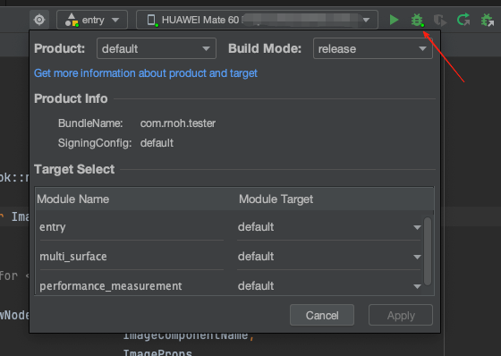

点击下方 debug 面板中的 lldb，进入 lldb 工具命令行，点击左侧按钮禁用断点

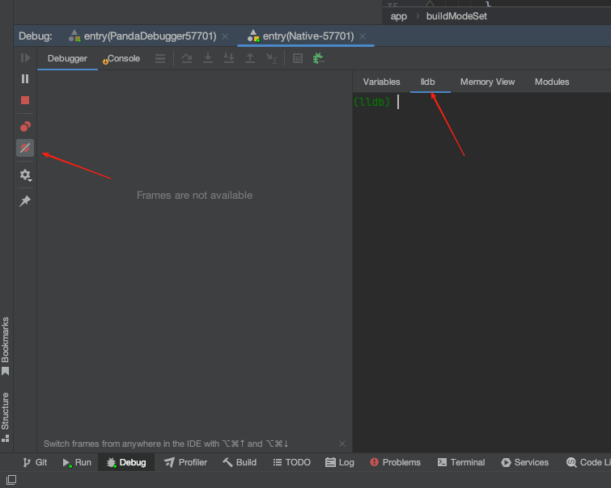

在 lldb 命令行中输入 `process handle`，获取所有可能导致程序暂停的信号量名称

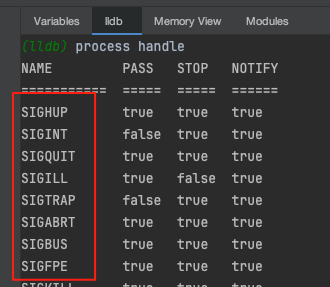

对于每个信号量执行 `process handle [信号量名称] -s false` ，让应用不在收到任何信号量时暂停影响采集。命令执行完后会立即输出信号量信息，可以看到 stop 一列都变成了 false

> Note: 您可以使用文本编辑器提供的[多光标能力](https://code.visualstudio.com/docs/editing/codebasics#_multiple-selections-multicursor)进行高效批量编辑

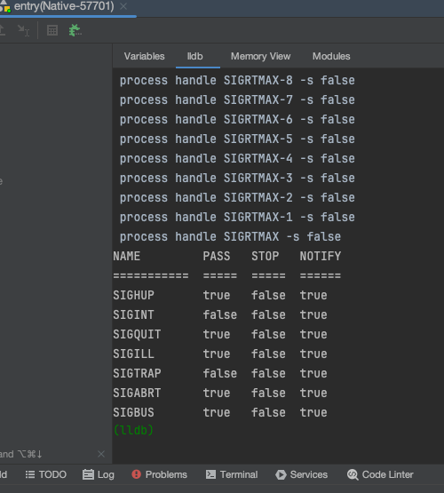

此时在lldb命令行输入采集profile命令 `process signal SIGUSR2` ，即可收集应用启动或上次执行这一命令到现在的应用运行profile。中间不重启应用执行两次采集命令，前一次采集的文件会被后一次覆盖。您可以利用此特性在应用的关键使用场景前后分别执行一次采集命令，这样收集到的就是关键场景使用过程中的profile信息。执行完此命令后检查输出路径对应的沙箱外路径应当看到新生成了名字以 .profraw 结尾的文件。

```shell
hdc shell ls /data/app/el2/100/base/[应用的bundle名]/files/pgoprofraw/
```

3. 整理运行数据：将 pgoprofraw 文件夹下载到电脑上

```shell
hdc file recv /data/app/el2/100/base/[应用的bundle名]/files/pgoprofraw/ .
```

使用 llvm-profdata 工具合并多个 profraw 文件并转换格式。llvm-profdata 工具跟步骤一构建日志中 `CXX compiler path:` 后面的 clang++ 在同一个目录下。使用不同版本的构建工具和 llvm-profdata 可能因为数据格式不兼容转换失败。

```shell
/path/to/llvm-profdata merge -output=pgo.profdata ./pgoprofraw/*.profraw
```

上述命令会在当前目录下生成 `pgo.profdata` 文件

4. 二次反馈编译：使用采集到的profile信息指导编译器构建高性能应用。注意在打包前恢复步骤1中临时添加的配置。参考下面的例子修改您的编译选项

```cmake
add_compile_options(
    -fprofile-use=/path/to/pgo.profdata
)
```

其中 `/path/to/pgo.profdata` 是到步骤三生成的 `pgo.profdata` 文件的路径。在 Windows 上首先将 `pgo.profdata` 和代码放在同一个盘上，路径开头不需要写盘符，路径使用 / 分隔。

您可以在[毕昇文档](https://www.hikunpeng.com/document/detail/zh/kunpengdevps/compiler/opg-bisheng/kunpengbisheng_30_0018.html)中查看更多介绍和注意事项。


### 字节码（HBC）

在进行性能调优的过程中，开发者可以选择将 JavaScript 包编译成 Hermes 字节码二进制文件， 将 JavaScript 代码转化为 Hermes 字节码，即 HBC 文件。Hermes 二进制包（通过编译 JavaScript 代码成 Hermes 字节码）具有以下几个关键性能优势：

- **更快的启动时间**：Hermes 将 JavaScript 代码预先编译为字节码（bytecode），而不是在运行时动态解析。相比标准的 JavaScript 引擎（如 JSC 或 V8），Hermes 可以跳过解析和编译步骤，从而显著缩短应用启动时间。对于移动设备，启动时间的减少会改善用户体验，尤其在应用首次加载时非常明显。
- **减少内存使用**：Hermes 编译生成的字节码比标准的 JavaScript 引擎更小且更高效，内存占用更少。Hermes 优化了字节码表示，去除了不必要的符号和调试信息，专注于执行效率。内存占用的减少使应用能够在低内存设备上运行得更加流畅。
- **更高效的垃圾回收机制**：Hermes 的垃圾回收器专门针对移动设备进行了优化。它使用了分代垃圾回收（generational garbage collection）策略，将内存分成多代来管理对象的生命周期。这个机制能显著减少暂停时间和内存碎片，从而提高应用的响应速度，并且有效利用移动设备的有限资源。
- **减少 JavaScript 编译时间**：Hermes 将 JavaScript 代码的编译移到了构建阶段，通过 `hermesc` 工具将 JavaScript 预编译为字节码，因此在应用运行时无需再进行编译。这减少了运行时的 CPU 负担，从而提高性能，特别是在复杂的应用程序或具有大量 JavaScript 代码的应用中，这种预编译能显著提升性能。

通过如下打包命令，开发者可以将 JavaScript 包转化为 HBC 包：

```cmd
npm run codegen && react-native bundle-harmony --dev=false --minify=true --bundle-output /tmp/bundle.harmony.js && hermesc --emit-binary /tmp/bundle.harmony.js -out ./harmony/entry/src/main/resources/rawfile/hermes_bundle.hbc
```

- **`hermesc`**：通过 `hermesc` 将生成的 JavaScript 包编译成 Hermes 字节码二进制文件。Hermes 引擎通过预先编译字节码减少启动时间。
- **`--dev`**：开启开发模式，这可能会影响 Hermes 的性能优化。

### TurboModule运行在子线程
在 React Native 的开发中，TurboModule 是一种模块系统，用于优化 JavaScript 和原生代码之间的通信性能。Android/iOS 中 TurboModule 运行在子线程中，本文将介绍在鸿蒙中将 TurboModule 运行在子线程。

#### 为什么要让TurboModule运行在子线程
当前鸿蒙 **RN** 的 TurboModule 运行在主线程，在主线程中 TurboModule 逻辑和主线程 UI 绘制逻辑竞争有限的主线程资源，如果主线程在进行 UI 绘制渲染，在渲染期间从 js 侧发起的 TurboModule 会被主线程阻塞，导致用户交互的响应不及时。同理，如果一个 TurboModule 方法本身耗时较长，那么在执行该 TurboModule 方法的时候，也会导致主线程的在进行 UI 渲染时丢帧。

#### 实现方案
启动 TurboModule 子线程的方式：由于 TurboModule 运行的线程是长时任务，故使用 worker 启动 TurboModule 子线程较为合适。
启动 TurboModule 子线程的时机：由于 JS 线程解析 bundle 时会调用 Networking、UIManager 等系统 TurboModule，所以需要在 APP 启动时启动 TurboModule 子线程。
切换 TurboModule 子线程的时机：在 `ArkTSTurboModule.cpp` 的 `callSync` 和 `callAsync` 中根据开发者配置切换到 TurboModule 子线程或者主线程。

#### 使用场景
需要在后台处理大量数据的任务,如解析 JSON、加密解密、图片处理等；
涉及大量数学计算、算法或者数据处理的任务；
对于音频/视频处理这样需要高性能实时计算的任务；
网络请求和相应处理任务；
文件读取、写入或者处理等 I/O 操作；

#### 避免场景
如果运行在子线程的 TurboModule 需要频繁切换到其它线程去调用其它线程的接口，或者需要发送大量数据给其它线程时，这些通信所带来的性能损耗可能会远远大于 TruboModule 运行在子线程所带
来的正向收益，如 `ImageLoaderTurboModule` ，由于该 TurboMoudle 由 UI 线程发起，所以该 TurboModule 运行在子线程时会导致线程切换非常频繁，进而变成负收益。

#### 实现步骤
由于 TurboMoudule 运行在子线程采用的是 arkTS 自带的 worker 线程，因此要创建 worker 线程执行的文件路径。
如果继承 `RNAbility`，需要重载 `getRNOHWorkerScriptUrl` 方法，返回类似以下格式的路径：
`@har/ets/workers/worker.ets` ，其中 @har 为对应 worker 线程执行文件所在的模块。
下面代码中这里使用了 "entry/ets/workers/RNOHWorker.ets"，其中 entry 是 `RNOHWorker.ets` 这个 worker 线程执行文件所在的模块：

```typescript
// entry/src/main/ets/entryability/EntryAbility.ets
import {RNAbility} from 'rnoh';

export default class EntryAbility extends RNAbility {
+  override getRNOHWorkerScriptUrl() {
+    return "entry/ets/workers/RNOHWorker.ets"
+  }
...
}
```
配置好 worker 线程执行的文件路径后，还需要实现改造 TurboMoudule 运行在子线程等步骤；
其余详细步骤见 `TurboMoule.md` 中的 `设置自定义Turbomodule运行在worker线程` 栏目

#### 总结
通过合理的使 TruboModule 运行在子线程，可以将繁重的计算和数据处理任务放在子线程中，合理利用 CPU 多核能力，减少主线程压力，确保 UI 的流畅性和用户交互的及时响应。

### 性能分析工具

在进行性能分析的时候，开发者可以使用 DevEco IDE 中的 Profiler 对应用的性能进行分析。具体的 Profiler 使用文档请参考：[使用DevEco Profiler进行性能调优](https://developer.huawei.com/consumer/cn/doc/harmonyos-guides-V5/ide-profiler-introduction-V5)。


### 三方库最新CAPI版本

在应用开发过程中，如果使用了三方库，确保使用的是最新版本，这不仅有助于功能更新，还能在性能和安全性上获得提升。获取最新三方库 **CAPI** 版本的具体途径请参考[三方库的官方文档](https://gitee.com/react-native-oh-library/usage-docs/tree/master/zh-cn)和资源。


## 应用场景调优
React 的渲染机制主要关注于如何高效地更新DOM以响应数据的变化。React 通过在虚拟 DOM 的 diff 算法，以及在合适的时机进行实际 DOM 更新来实现这一点。

React 的渲染机制可以概括为以下几个步骤：

1、当组件的状态或属性更新时，React 会使用新的属性和状态创建一个新的虚拟 DOM 树。

2、React 会 diff 算法比较新旧虚拟 DOM 树之间的差异。

3、根据 diff 结果，React 会更新并且只更新实际 DOM 中需要变化的部分。

以下是一个 react 组件的简单例子：

```javascript
import React from 'react'
import {Text, Button} from 'react-native'

export default class App extends React.Component<Props, State> {
    state = { count: 0 }
    increment = () => {
        const { count } = this.state
        const newCount = count < 5 ? count + 1 : count
        console.log('App Button click newCount', newCount)
        this.setState({ count: newCount })
    };
    render(): React.ReactNode {
        const { count } = this.state
        console.log('render')
        return (
            <>
                <Text>{count}</Text>
                <Button title={'Increment'} onPress={this.increment} />
            </>
        )
    }
}
```

这个例子多次点击 increment 按钮会有以下结果：


由图可以看出 当 count 不再发生变化以后，还会继续执行 render 函数，会导致性能劣化。我们应该避免相同 state 触发 render。

### 渲染优化方法

#### 使用PureComponent

#### PureComponent的原理

`PureComponent` 是对 react 的 `shouldComponentUpdate` 的方法重新去优化的，该方法将浅比较 `props` 和 `state`，当 `props` 和 `state` 发生改变时就会触发 render：

以下是一个使用 PureComponent的demo：
```javascript
import React from 'react'
import {Text, Button} from 'react-native'

export default class App extends React.PureComponent<Props, State> {
    state = { count: 0 }
    increment = () => {
        const { count } = this.state
        const newCount = count < 5 ? count + 1 : count
        console.log('App Button click newCount', newCount)
        this.setState({ count: newCount })
    };
    render(): React.ReactNode {
        const { count } = this.state
        console.log('render')
        return (
            <>
                <Text>{count}</Text>
                <Button title={'Increment'} onPress={this.increment} />
            </>
        )
    }
}
```
执行结果如图所示：


从图中可以看出，当 count 不再发生变化以后，不会再触发 render。

#### PureComponent的缺陷

1、**深层次的数据不变性问题**：由于 `PureComponent` 使用浅比较来判断数据是否有变化，如果对象中的某些深层次的数据发生了变化，它可能不会触发重新渲染。
2、**对象引用变化时不更新**： 即使对象的内容变化了，如果它的引用没有变化（即始终指向同一个对象），PureComponent 也不会重新渲染。

```javascript
import React from 'react'
import { Text, Button } from 'react-native'

class Child extends React.PureComponent<Props, State> {
    render(): React.ReactNode {
        console.log('child render')
        return (
            <Text>{this.props.person.age}</Text>
        )
    }
}

export default class App extends React.PureComponent<Props, State> {
    person = { age: 25, count: 0 }
    state = { count: 0, person: this.person }
    increment = () => {
        const { count } = this.state
        const newCount = count < 5 ? count + 1 : count
        console.log('App Button click newCount', newCount, this.person)
        this.person.age++ // child不会触发render
        // this.person = { age: 26 } // child会触发render
        this.setState({ count: newCount })
    };
    render(): React.ReactNode {
        const { count } = this.state
        console.log('render')
        return (
            <>
                <Text>{count}</Text>
                <Button title={'Increment'} onPress={this.increment} />
                <Child person={this.person}/>
            </>
        )
    }
}
```

#### 重写shouldComponentUpdate

如果你定义了 `shouldComponentUpdate`，React 将调用它来确定是否可以跳过重新渲染。

```javascript
import React from 'react'
import { Text, Button } from 'react-native'

export default class App extends React.Component<Props, State> {
    state = { count: 0 }
    increment = () => {
        const { count } = this.state
        const newCount = count < 5 ? count + 1 : count
        console.log('App Button click newCount', newCount)
        this.setState({ count: newCount })
    };
    shouldComponentUpdate(nextProps: Props, nextState: State, nextContext: any): boolean {
        console.log('shouldComponentUpdate')
        return nextState.count !== this.state.count
    }
    render(): React.ReactNode {
        const { count } = this.state
        console.log('render')
        return (
            <>
                <Text>{count}</Text>
                <Button title={'Increment'} onPress={this.increment} />
            </>
        )
    }
}
```
执行结果如图所示：  


#### 使用React.memo

`memo` 允许你的组件在 props 没有改变的情况下跳过重新渲染。

我们先看以下一段 demo：

```javascript
import React from 'react'
import { Text, Button } from 'react-native'

class Child extends React.Component<Props, State> {
    render(): React.ReactNode {
        console.log('child render');
        
        return <Text>{this.props.text}</Text>
    }
}

export default class App extends React.Component<Props, State> {
    state = { count: 0 }
    increment = () => {
        const { count } = this.state
        const newCount = count < 5 ? count + 1 : count
        console.log('App Button click newCount', newCount)
        this.setState({ count: newCount })
    };
    render(): React.ReactNode {
        const { count } = this.state
        console.log('render')
        return (
            <>
                <Text>{count}</Text>
                <Button title={'Increment'} onPress={this.increment} />
                <Child text={"child text"} />
            </>
        )
    }
}
```
执行结果如下，可见 Child 组件的 props 没发生变化时，Child 组件也会重新渲染：  


使用 memo 可以保证在 props 没有改变的情况下，不渲染 Child 组件。具体 Demo 如下：
```javascript
import React from 'react'
import { Text, Button } from 'react-native'

const isEqual = (prevProps:Props, nextProps:Props) => {
    return prevProps.text === nextProps.text
}

const Child = React.memo((props:Props) => {
    console.log('Child render');
    return (
        <Text>{props.text}</Text>
    )
}, isEqual)

export default class App extends React.Component<Props, State> {
    state = { count: 0 }
    increment = () => {
        const { count } = this.state
        const newCount = count < 5 ? count + 1 : count
        console.log('App Button click newCount', newCount)
        this.setState({ count: newCount })
    };
    render(): React.ReactNode {
        const { count } = this.state
        console.log('render')
        return (
            <>
                <Text>{count}</Text>
                <Button title={'Increment'} onPress={this.increment} />
                <Child text={"child text"} />
            </>
        )
    }
}
```

执行结果如下，发现 child 组件不再重复渲染：  
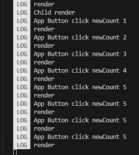

#### 使用函数式组件

React 函数式组件是一个简单的函数，接收 props 作为参数并返回 React 元素。它没有类组件中的生命周期方法和状态，因此通常被认为是轻量级的。

以下是一个函数式组件的 demo：

```javascript
import React, { useState } from 'react'
import { Text, Button } from 'react-native'


export default function App() {
    const [count, setCount] = useState(0)
    const increment = () => {
        const newCount = count < 5 ? count + 1 : count
        console.log('App Button click newCount', count, newCount)
        setCount(newCount)
    }
    console.log('App render');
    
    return (
        <>
            <Text>{count}</Text>
            <Button title={'Increment'} onPress={increment} />
        </>
    )
}
```
执行结果如图所示：  
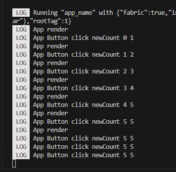

#### 属性对象创建一次

```javascript
import React from 'react'
import { Text, Button } from 'react-native'

class Child extends React.PureComponent<Props, State> {
    render(): React.ReactNode {
        console.log(`${this.props.text} render`)
        return (
            <Button title={this.props.text} onPress={this.props.click}></Button>
        )
    }
}

export default class App extends React.PureComponent<Props, State> {
    constructor(props) {
        super(props)
        this.state = { count: 0}
        console.log("app constructor");
        this.onBindClick = this.clickAction.bind(this)

    }
    clickAction = () => {
        console.log("clickAction");
    }
    increment = () => {
        const { count } = this.state
        const newCount = count < 5 ? count + 1 : count
        console.log('App Button click newCount', newCount)
        this.setState({ count: newCount })
    }

    render(): React.ReactNode {
        const { count } = this.state
        console.log('render')
        return (
            <>
                <Text>{count}</Text>
                <Button title={'Increment'} onPress={this.increment} />
                {/* 父render变化，子render一定变化 */}
                <Child text={"Child_1"} click={() => console.log("clickAction")} />
                {/* 父render变化，子不变化 */}
                <Child text={"Child_2"} click={this.clickAction} />
                {/* 父render不会，子render一定变化 */}
                <Child text={"Child_3"} click={this.clickAction.bind(this)} />
            </>
        )
    }
}

```
执行结果如下：  
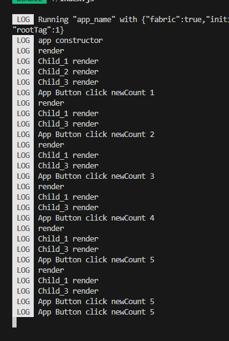

#### 在子组件render

若 App 内元素过多，每次重新渲染 App 组件都会重新渲染里面的元素，造成不必要的 render。可以拆分一个独立的 render 到子组件里：  
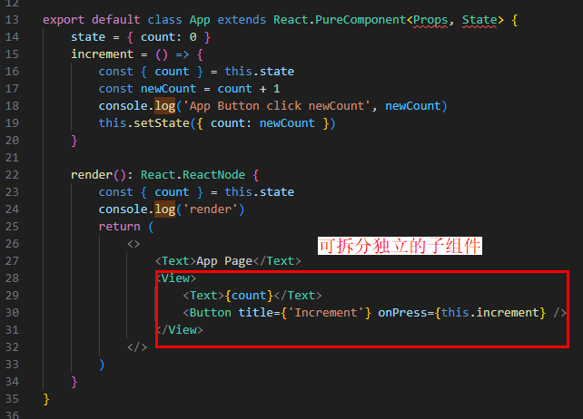

可以把其中独立的部分拆分到一个子组件 Child 里：  

```javascript
import React from 'react'
import { Text, Button, View } from 'react-native'

class Child extends React.PureComponent<Props, State> {
    state = { count: 0 }
    increment = () => {
        const { count } = this.state
        const newCount = count + 1
        console.log('Child Button click newCount', newCount)
        this.setState({ count: newCount })
    }
    render(): React.ReactNode {
        const { count } = this.state
        console.log("Child render")
        return (
            <View>
                <Text>{count}</Text>
                <Button title={'Increment'} onPress={this.increment} />
            </View>
        )
    }
}

export default class App extends React.PureComponent<Props, State> {

    render(): React.ReactNode {
        console.log('render')
        return (
            <>
                <Text>App Page</Text>
                <Child />
            </>
        )
    }
}
```
执行结果如图所示，App 只 render 了一次  


#### 合并setState
在实际业务中可能需要在请求数据之前或之后设置多次 state，形如以下代码：
```javascript
this.setState(state => {
    totalLength: 0
}, () => {
    this.setState({
        loading: true
    })
    getData().then(res => {
        ...
    })
})
```

可以修改为以下形式：
```javascript
this.setState(state => {
    totalLength: 0,
    loading: true
}, () => {
    getData().then(res => {
        ...
    })
})
```
对于多个异步执行 setState 的场景，也可以使用 Promise 来进行合并，形如以下代码：
```javascript
getMeeting().then(info => this.setState({info}))
getUserList().then(userList => this.setState({userList}))
```
可以修改为：
```javascript
Promise.all([
    getMeeting(),
    getUserList()
]).then([info, userList] => {
    this.setState({
        info,
        userList
    })
})
```

#### setState不使用对象

我们应该将对象属性作为 state 变量，而不是对象本身。如下代码展示，直接改变 person 内的 age，不会触发 Child 的 render。age 虽然会增加，但是显示的一直是 25。

```javascript
import React from 'react'
import { Text, Button } from 'react-native'

class Child extends React.PureComponent<Props, State> {
    render(): React.ReactNode {
        console.log('child render')
        return (
            <Text>{this.props.person.age}</Text>
        )
    }
}

export default class App extends React.PureComponent<Props, State> {
    person = { age: 25, count: 0 }
    state = { count: 0, person: this.person }
    increment = () => {
        const { count } = this.state
        const newCount = count < 5 ? count + 1 : count
        console.log('App Button click newCount', newCount, this.person)
        this.person.age++ 
        this.setState({ count: newCount })
    };
    render(): React.ReactNode {
        const { count } = this.state
        console.log('render')
        return (
            <>
                <Text>{count}</Text>
                <Button title={'Increment'} onPress={this.increment} />
                <Child person={this.person}/>
            </>
        )
    }
}
```
#### React 18 Automatic batching特性

React 18在发布的时候引入了多个特性，包括：自动批量变更状态(Automatic batching)，新的严格模式(Strict Mode)，以及新的hooks(useId, useSyncExternalStore)。在性能方面，自动批量变更状态，即Concurrency，会对渲染有一定的优化，因此该部分将对应用开发中的自动批量变更状态进行介绍。

根据[React官方对于Concurrency的描述](https://react.dev/blog/2022/03/29/react-v18)：


> Concurrency并不是一个特性，而是一个React新的后端机制，这个机制使得React能够在同个时间内准备多个当前UI的渲染。

> Concurrent React的一个关键特性是渲染是可中断的。当您首次升级到React 18时，在添加任何并发功能之前，更新的呈现方式与React的早期版本相同——在单个、不中断的同步事务中。使用同步渲染，一旦更新开始渲染，在用户可以在屏幕上看到结果之前，任何东西都不能中断它。

> 在并发渲染中，并不总是这种情况。React可能会开始渲染更新，在中间暂停，然后稍后继续。它甚至可能完全放弃正在进行的渲染。React保证即使渲染中断，UI也会显示一致。要做到这一点，它等待执行DOM突变，直到结束，一旦整个树已经被评估。有了这个功能，React可以在后台准备新的屏幕，而不会阻塞主线程。这意味着UI可以立即响应用户输入，即使它处于大型渲染任务的中间，从而创造流畅的用户体验。

> 另一个例子是可重用状态。Concurrent React可以从屏幕中移除UI的部分，然后在稍后重新添加它们，同时重用之前的状态。例如，当用户Tab离开屏幕并返回时，React应该能够将之前的屏幕恢复到它之前所处的相同状态。

具体在开发当中，自动批量变更状态会对setState的批量提交有所影响。在RNOH中，默认是会启用自动批量变更状态的，对应`RNInstance.ts`中的:

```typescript
export type RNInstanceOptions = {
    ...
    /**
     * Disables advanced React 18 features, such as Automatic Batching.
     * Setting this to `true` will revert to the behavior of React 17,
     * where state updates are processed synchronously and separately.
     */
    disableConcurrentRoot?: boolean;
    ...
}

...

export class RNInstanceImpl implements RNInstance {
    ...
    constructor() {
        ...
        this.defaultProps = { concurrentRoot: !disableConcurrentRoot };
        ...
    }
}
```

在默认状态下，RNOH会设置`disableConcurrentRoot`为`false`，即设置`concurrentRoot`为`true`，即设置自动批量变更状态为开启。
在引入该特性之前，如果页面中有组件进行`setState`的提交，页面会进行响应并重新渲染，每一次`setState`会对应一次页面的重新渲染。如果有多个组件同时setState进行提交的话，会造成页面重新渲染次数过多，线程过于繁忙，导致应用卡顿。在开启该功能之后，每6~7次的`setState`才会进行一次页面的重新渲染，对于复杂页面中的多次`setState`的情况会有不错的性能收益。因此推荐对该变量不做修改，默认开启自动批量变更状态。


#### 给列表Item增加key

通常在多个不确定的子组件的情况下，会使用 map 循环遍历渲染 Child 组件，如下代码：

```javascript
import React from 'react'
import { Text, Button, View } from 'react-native'

class Child extends React.PureComponent<Props, State> {
    render(): React.ReactNode {
        console.log("Child render")
        return (
            <View>
                <Text>{this.props.age}</Text>
            </View>
        )
    }
}

export default class App extends React.PureComponent<Props, State> {
    items = [0]
    state = { count: 0, items: this.items }

    increment = () => {
        this.items.unshift(this.items.length)
        const { count } = this.state
        const newCount = count < 5 ? count + 1 : count
        console.log('App Button click， items：', this.items)
        this.setState({ count: newCount, items: this.items })
    }
    render(): React.ReactNode {
        const { items } = this.state
        console.log('app render')
        return (
            <>
                <Text>App Page</Text>
                <Button title={'Increment'} onPress={this.increment} />
                {
                    items.map((item) => {
                        return <Child age={25 + item} />

                    })
                }
            </>
        )
    }
}
```

执行结果如图所示，可以看见 每次父组件发生变化，所有 Child 都要重新渲染一次：  


为了避免多余的 Child 更新，我们应该给 Child 组件加上 key：
```typescript
return <Child key={item} age={25 + item} />
```
修改后执行结果如图所示，每次只 render 新增的 Child  


#### 优化条件渲染

我们还可以在条件判断上进行抽离优化，如图所示的代码：
```javascript
import React from 'react'
import { Text, Button, View } from 'react-native'

class Child extends React.PureComponent<Props, State> {
    render(): React.ReactNode {
        console.log("Child render age：", this.props.age)
        return (
            <View>
                <Text>{this.props.age}</Text>
            </View>
        )
    }
}

export default class App extends React.PureComponent<Props, State> {
    state = { count: 0 }

    increment = () => {
        const { count } = this.state
        const newCount = count < 5 ? count + 1 : count
        console.log('App Button click')
        this.setState({ count: newCount })
    }
    render(): React.ReactNode {
        console.log('app render')
        return (
            <>
                <Text>App Page</Text>
                <Button title={'Increment'} onPress={this.increment} />
                {
                    this.state.count % 2 === 0 ? (
                        <>
                            <Child age={25} />
                            <Child age={26} />
                            <Child age={27} />
                        </>
                    ) : (
                        <>
                            <Child age={26} />
                            <Child age={27} />
                        </>
                    )
                }
            </>
        )
    }
}
```
执行结果如下：  


每次条件判断发生改变都会重新渲染内部的全部 Child，我们可以进行合理的抽离：

```typescript
return (
    <>
        <Text>App Page</Text>
        <Button title={'Increment'} onPress={this.increment} />
        <>
            {this.state.count % 2 === 0 && <Child age={25} />}
            <Child age={26} />
            <Child age={27} />
        </>
    </>
)
```

执行结果如下，只对切换的部分进行 render：  
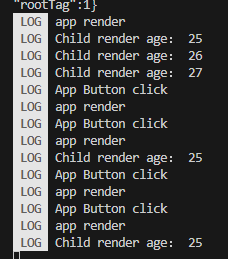

#### 特定条件下不使用render

我们可以合理使用 `setNativeProps` 来避免频繁 render。

官方的 `TouchableOpacity` 这个组件就在内部使用了 `setNativeProps` 方法来更新其子组件的透明度：
```javascript
const viewRef = useRef<View>();
const setOpacityTo = useCallback(value => {
  // Redacted: animation related code
  viewRef.current.setNativeProps({
    opacity: value,
  });
}, []);
```
以下是一个 `TouchableOpacity` 的 demo：
```javascript
export default class App extends React.PureComponent<Props, State> {
    constructor(props) {
        super(props)
        this.state = { myButtonOpacity: 1 }
    }
    render(): React.ReactNode {
        console.log('app render')
        return (
            <TouchableOpacity
                onPress={() => {
                    console.log("app onPress");
                    this.setState({ myButtonOpacity: 0.5 })
                }}
                onPressOut={() => this.setState({ myButtonOpacity: 1 })}
            >
                <View style={{height: 100}}>
                    <Text>App Page</Text>
                </View>
            </TouchableOpacity>
        )
    }
}
```

执行结果如图所示：  
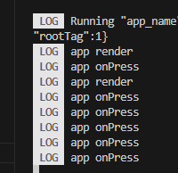


### 预加载

##### 预加载RN页面

在鸿蒙操作系统中使用 ArkTS 进行页面预加载是一种高效的优化方式。ArkTS（Ark TypeScript）是鸿蒙的编程语言，结合鸿蒙系统的能力，可以在页面切换时提供更流畅的用户体验。本文将介绍如何在鸿蒙操作系统中使用 ArkTS 进行页面预加载。

##### 为什么要进行页面预加载？

在鸿蒙应用中，页面切换可能会涉及大量资源加载、布局计算等操作。如果不进行预加载，用户在切换页面时可能会遇到明显的延迟。通过预加载页面，开发者可以在用户实际访问页面之前提前加载资源，从而减少页面切换时的等待时间。

##### 实现步骤

1. 初始化 ArkTS 页面

    首先，确保你的鸿蒙应用是基于 ArkTS 编写的。以下是一个基础页面结构示例：

    ```javascript
    @Entry
    @Component
    struct MainPage {
    build() {
        Column() {
        Button("Go to Preloaded Page")
            .onClick(() => {
            // 跳转到预加载页面
            router.push({ url: "pages/PreloadedPage" });
            });
        }
    }
    }
    ```

2. 创建预加载逻辑

    在 ArkTS 中，可以通过在应用启动或页面初始化时，提前加载目标页面的资源。这可以通过提前初始化页面组件或者预先进行一些计算来实现。

    ```typescript
    @Component
    struct PreloadedPage {
    @State data: string = "";

    // 在页面初始化时预加载数据
    aboutToAppear() {
        this.preloadData();
    }

    preloadData() {
        // 进行数据的预加载操作，例如数据请求或资源加载
        ...
    }

    build() {
        Column() {
        Text(this.data.isEmpty() ? "Loading..." : this.data);
        }
    }
    }
    ```

3. 在应用启动时进行预加载

    在应用的主页面或启动时，可以调用页面的预加载逻辑。这样当用户实际切换到该页面时，资源已经准备就绪。

    ```javascript
    @Entry
    @Component
    struct MainPage {
    @State isPreloaded: boolean = false;

    build() {
        Column() {
        Button(this.isPreloaded ? "Go to Preloaded Page" : "Preloading...")
            .onClick(() => {
            if (this.isPreloaded) {
                router.push({ url: "pages/PreloadedPage" });
            }
            });
        }
    }

    // 在页面加载时预先加载目标页面
    aboutToAppear() {
        this.preloadPage();
    }

    preloadPage() {
        // 模拟页面预加载
        setTimeout(() => {
        this.isPreloaded = true;
        console.log("Page preloaded");
        }, 1000);
    }
    }
    ```

    可参考 FrameNode 预加载 **RN** 页面中的例子。

4. 页面切换时的性能优化

    在预加载页面资源后，切换页面时可以直接显示已经加载好的内容，减少延迟。你可以在页面切换过程中使用过渡动画或其他优化技术，进一步提升用户体验。

    ```typescript
    router.push({
    url: "pages/PreloadedPage",
    transition: { type: "slide", duration: 300 }
    });
    ```

##### 总结

通过在鸿蒙操作系统中使用 ArkTS 进行页面预加载，开发者可以显著提升应用的性能和响应速度。预加载不仅减少了页面切换时的延迟，还能改善整体用户体验。在实际应用中，开发者可以根据不同的业务需求灵活调整预加载策略，以达到最佳效果。

#### 预创建RN实例

在鸿蒙操作系统中使用 ArkTS 进行 React Native 实例的预创建，可以有效提升应用启动和页面切换的性能。通过在应用启动阶段提前初始化 React Native 实例，你可以减少用户在访问页面时的延迟。本文将详细介绍如何在 ArkTS 中实现 React Native 实例的预创建。

##### 为什么要进行 React Native 实例预创建？

ArkTS 是鸿蒙操作系统的主要开发语言，结合鸿蒙系统的能力，可以更好地管理应用资源和任务。通过 ArkTS 进行 React Native 实例的预创建，开发者可以利用鸿蒙系统的多任务和资源管理能力，确保应用在启动时更加流畅。

##### 实现步骤

1. 创建预加载逻辑

    在应用启动时，使用 ArkTS 的生命周期回调来预创建 React Native 实例。通过在应用初始化阶段创建实例，可以提前加载 React Native 环境，减少后续页面加载时间。

    ```javascript
    @Entry
    @Component
    struct MainAbility {
    @State reactInstanceReady: boolean = false;

    build() {
        Column() {
        if (this.reactInstanceReady) {
            // React Native 实例已准备好
            Button("Go to React Native Page")
            .onClick(() => {
                // 跳转到 React Native 页面
                router.push({ url: "pages/ReactNativePage" });
            });
        } else {
            // 显示加载中提示
            Text("Loading React Native instance...");
        }
        }
    }

    aboutToAppear() {
        // 在应用启动时预创建 React Native 实例
        this.preCreateReactNativeInstance();
    }

    preCreateReactNativeInstance() {
        // 进行 React Native 实例的初始化
        ...
    }
    }
    ```
    可参考 FrameNode 预加载 **RN** 页面中的例子。


2. 创建 React Native 页面

    在 ArkTS 中，你可以将 React Native 页面作为应用的一部分进行管理。通过在页面实际展示之前，使用预创建的实例，可以加快页面的显示速度。

    ```typescript
    @Component
    struct ReactNativePage {
    build() {
        Column() {
        Text("This is a React Native Page")
            .fontSize(20)
            .fontWeight(FontWeight.Bold);
        // 在这里加载和显示 React Native 视图
        }
    }

    // 加载 React Native 视图时，使用预创建的实例
    aboutToAppear() {
        console.log("React Native Page initialized with preloaded instance");
    }
    }
    ```

3. 页面切换优化

    在页面切换时，可以利用鸿蒙系统的动画和过渡效果，进一步提升用户体验。例如，在页面切换时添加平滑的过渡动画，使用户感受到更加自然的体验。

    ```typescript
    router.push({
    url: "pages/ReactNativePage",
    transition: { type: "slide", duration: 300 }
    });
    ```

##### 总结

通过在鸿蒙操作系统中使用 ArkTS 进行 React Native 实例的预创建，可以显著提升应用的启动速度和页面切换的流畅性。ArkTS 结合鸿蒙系统的强大特性，使得开发者可以更加灵活地管理 React Native 实例的生命周期。在实际开发中，可以根据具体需求调整预创建策略，确保应用在性能和资源使用之间达到平衡。

#### FrameNode预加载RN页面

在 React Native 的开发中，Bundle预加载是一个常见的优化手段，可以在应用启动或者切换页面的时候提前进行资源的加载，提升用户体验。本文将介绍如何用 FrameNode 在鸿蒙中实现 React Native 页面的预加载。

##### 什么是FrameNode
对于具备自己前端定义的三方框架 React Native ，需要将特定的 dsl 转换成为 ArkUI 的声明式描述。这个转换过程需依赖额外的数据驱动绑定至 Builder 中，转换比较复杂且性能较低。这依赖了系统 ArkUI 框架的布局、事件能力，以及最基础的节点操作和自定义能力，大部分组件通过自定义完成，但是需要使用部分原生组件混合显示。FrameNode 的设计就是为了解决上述的问题。

FrameNode 表示组件树的实体节点，配合自定义占位容器组件 NodeContainer 等，在占位容器内挂载一棵自定义的节点树，并对这个节点树中的节点进行动态的增加、修改、删除等操作。基础的 FrameNode 可以设置通用属性、设置事件回调，并提供完整的自定义能力，包括自定义测量、布局以及绘制。

除此之外，ArkUI 框架还提供获取和遍历获得原生组件对应的代理 FrameNode 对象的能力，下文简称代理节点。代理节点可以用于需要遍历整个 UI 的树形结构，并支持获取原生组件节点的具体信息或者额外注册组件的事件监听回调。

详细信息可以参考 OpenHarmony 官方文档：https://developer.huawei.com/consumer/cn/doc/harmonyos-guides-V5/arkts-user-defined-arktsnode-framenode-V5


##### 使用场景
在开发复杂应用时，页面切换的性能至关重要。如果目标页面需要加载大量资源（如图片，文字等），可以通过 FrameNode 提前进行加载和渲染，从而减少页面切换时的延迟。

##### 实现步骤
我们以[FrameNode预加载Sample](../Samples/FrameNodeSample)对 FrameNode 的加载进行实现步骤的讲解。在这个例子中，我们会尝试构建一个简单的 React Native 页面，其中主要包含了两个页面，分别为一个首页与一个 React Native 页面。其中首页通过 ArkTS 原生编写，而另一个页面则是一个需要加载 bundle 的 React Native 页面。

具体的流程图如下所示：


首先，我们在首页的 `Index.est` 中的 `prepareRNEnv()` 环节进行初始化，加载基础 bundle。使用 `common.est` 中的 `createRNController` 进行 `NodeControllerd` 的创建，并且绑定上对应的 `instanceKey`。同时也执行 `BuilderNode` 的 `build` 方法，创建并返回 `FrameNode`。


```typescript
// index.est中的prepareRNEnv()阶段
async prepareRNEnv(): Promise<Map<string, RNInstance>> {
    this.rnohCoreContext = AppStorage.get('RNOHCoreContext');
    let instanceMap: Map<string, RNInstance> = new Map();

    const cpInstance: RNInstance = await this.rnohCoreContext!.createAndRegisterRNInstance({
      createRNPackages: createRNPackages,
      enableNDKTextMeasuring: true,
      enableBackgroundExecutor: false,
      enableCAPIArchitecture: true,
      arkTsComponentNames: arkTsComponentNames
    }
    );
    const ctxCp: RNComponentContext = new RNComponentContext(
      RNOHContext.fromCoreContext(this.rnohCoreContext!, cpInstance),
      wrapBuilder(buildCustomComponent),
      wrapBuilder(buildRNComponentForTag),
      new Map()
    );

    LoadManager.cpInstance = cpInstance;
    await cpInstance.runJSBundle(new ResourceJSBundleProvider(getContext().resourceManager,
      'bundle/bundle.harmony.js'));
    instanceMap.set('CPReactInstance', cpInstance);

    return instanceMap;
  }
```

```typescript
// common.ets中的MyNodeController，进行FrameNode创建并返回
class MyNodeController extends NodeController {
  private rootNode: BuilderNode<[Params]> | null = null;
  private isRemove: boolean = false;

  aboutToAppear(): void {
  }

  aboutToResize(size: Size): void {
  }

  setRemove(status: boolean) {
    this.isRemove = status;
  }

  makeNode(uiContext: UIContext): FrameNode | null {
    if (this.isRemove) {
      return null;
    }

    if (this.rootNode === null) {
      this.rootNode = new BuilderNode(uiContext);
      this.rootNode.build(wrapBuilder<BuilderData[]>(myRNPageBuilder), { text: 'This is a Text' })
    }

    return this.rootNode.getFrameNode();
  }

  rebuild(): void {
    super.rebuild();
  }

  update(message: string) {
    if (this.rootNode !== null) {
      this.rootNode.update({ text: message });
    }
  }

  init(instanceKey: string, uiContext: UIContext) {
    if (this.rootNode != null) {
      return;
    }
    this.rootNode = new BuilderNode(uiContext)
    this.rootNode.build(wrapBuilder<BuilderData[]>(myRNPageBuilder), { text: 'This is a Text' })
  }
}
```

在 `common.est` 中使用 `FrameNodeRNPage` 的构造器，传入对应的 Instance, bundle 进行预加载。

```typescript
// FrameNodePage.ets中的build()
build() {
    Stack() {
      BaseRN({
        rnInstance: this.instance,
        moduleName: this.moduleName,
        bundlePath: this.bundlePath,
      }).align(Alignment.Top).margin({ top: 0 })
    }
  }
```

通过上述的步骤，我们就可以在 `index.ets` 进行加载的同时对需要进行 bundle 加载的页面进行预加载。之后在进行首页中的按键点击时，对应的 `RNPage.est` 页面已完成加载，可以进行更快的渲染。

##### 总结
通过使用 FrameNode 进行 bundle 预加载，可以显著提升 OpenHarmony 应用的启动和页面切换性能。上述步骤展示了如何在应用中实现这一功能，开发者可以根据实际需求进行灵活调整。

## 组件性能调优

### Flatlist

#### 开启子视图剪裁

设置容器的`removeClippedSubviews`属性为true，可以开启子视图剪裁特性。该特性通过检查子视图是否可见，决定对应ArkUI组件是否上树、下树。

剪裁特性通过在ArkUI侧移除、添加子节点实现下树、上树。这意味着：
- 下树时，剪裁算法不会销毁任何RN组件或ArkUI节点。
- 上树时，剪裁算法不会创建任何RN组件或ArkUI节点。
- 不会改变影子树。
- 会改变ArkUI节点树。
- 下树/上树时，子节点及其下方所有孙子节点的相对关系不会发生变化。
- 子节点其下方所有孙子节点是上树、下树的最小单位。

#### 长列表不设置initialNumToRender

序号大于等于`initialNumToRender`的Item的渲染速度较慢。长列表不应设置`initialNumToRender`。